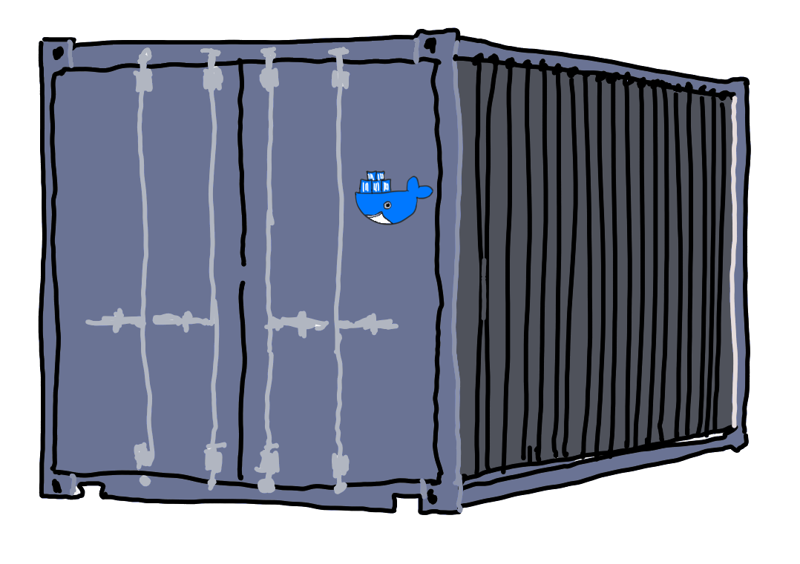
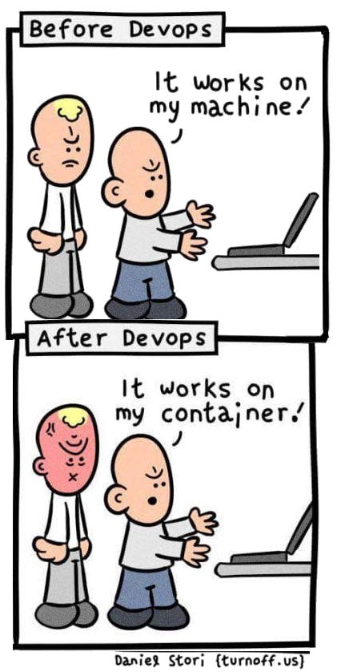

<style>

section {
  background-color: #fefefe;
  color: #333;
}

img[alt~="center"] {
  display: block;
  margin: 0 auto;
}
blockquote {
  background: #ffedcc;
  border-left: 10px solid #d1bf9d;
  margin: 1.5em 10px;
  padding: 0.5em 10px;
}
blockquote:before{
  content: unset;
}
blockquote:after{
  content: unset;
}
</style>

<!-- _class: lead -->

# Module 1 : Les Fondamentaux 
## Les Conteneurs et Docker

*Formation Kubernetes - Débutant à Avancé*

---

## Sommaire du Module 1

- Qu'est-ce qu'un conteneur ?
- Conteneurs vs Machines Virtuelles
- Cas d'usage de la conteneurisation
- Docker : démocratiser les containers
- Dockerfile : écrire des recettes
- Commandes Docker essentielles
- Docker Registry : stockage d'images
- **TP pratique** : Créer et publier votre image



---

## Qu'est-ce qu'un conteneur ?

> C'est une boite 📦

Ensemble de techniques qui vont permettre d'**isoler** un processus des autres processus, du système de fichiers et des ressources de l'hôte.

Il existe plein de technos de containers : Docker est "juste" l'outil que les a popularisé.

* voir aussi : [jail BSD](https://docs.freebsd.org/en/books/handbook/jails/), [zone Solaris](https://docs.oracle.com/cd/E19253-01/820-2318/zones.intro-1/index.html), [openVZ](https://openvz.org/), [LXC](https://linuxcontainers.org/), ...

---

## Quelques différences containers vs VMs

- ➕ démarrage rapide (pas de matériel à émuler / d'OS à démarrer)
- ➕ consommation souvent plus faible qu'une VM (ça dépend)
- ➖ partage du kernel (problématique pour certaines apps)
- ➖ isolation plus faible (sécurité ---)
- ⚖️ **immuabilité**

Note : Il existe des solution de type microVMs qui peuvent être un entre deux intéressant (ex : [Firecracker](https://firecracker-microvm.github.io/))

---

## Cas où la conteneurisation brille ✨

- **Microservices** : mutualisation des ressources d'un hôte
- Apps **stateless** (mise à l'échelle simple)
- **DevXP** : plus simple de construire un container qu'une VM
- Package *unique* censé fonctionner "partout"

> *"Build once, run anywhere"* 🚀



---

## Docker : démocratise les containers linux

* [dotScale 2013 - Solomon Hykes - Why we built Docker](https://www.youtube.com/watch?v=3N3n9FzebAA)

- **Engine** : Runtime de conteneurs ([cgroups, namespaces](https://www.youtube.com/watch?v=sK5i-N34im8))
- **Images** : Templates pour les conteneurs
- **Registry** : Stockage d'images (Docker Hub)
- **Compose** : Orchestration simple
- **Desktop** : Interface graphique

---

## Dockerfile : La recette 📝

- On créé un Dockerfile comme on écrirait un script d'installation
- Des opérations basiques sont listées (FROM, COPY, etc)
- L'ensemble de ces instructions donne une *image Docker*


```dockerfile
FROM node:24-alpine
WORKDIR /app
COPY package*.json ./
RUN npm install
COPY . .
EXPOSE 3000
CMD ["npm", "start"]
```

---

## Système de fichiers en couches

Docker utilise un **système de fichiers en couches** (layered FS) :

- Chaque instruction du Dockerfile = une **couche** (layer)
- Les couches sont **empilées** et **immuables**
- **Réutilisation** : les images peuvent partager des couches communes
- **Optimisation** : seules les couches modifiées sont re-téléchargées

```
┌─────────────────┐ ← Couche application  (RW)  ^
├─────────────────┤ ← COPY . .            (RO)  |
├─────────────────┤ ← RUN npm install     (RO)  | de bas en haut
├─────────────────┤ ← COPY package.json   (RO)  |
└─────────────────┘ ← FROM node:22-alpine (RO)  |
```

---

## Exemple : `docker pull` avec plusieurs couches

```bash
$ docker pull nginx:latest
latest: Pulling from library/nginx
31b3f1ad4ce1: Pulling fs layer
fd42b079d0f8: Pulling fs layer  
18f4ffdd1b9d: Pulling fs layer
18f4ffdd1b9d: Waiting
fd42b079d0f8: Download complete
31b3f1ad4ce1: Download complete
18f4ffdd1b9d: Download complete
31b3f1ad4ce1: Pull complete
fd42b079d0f8: Pull complete
18f4ffdd1b9d: Pull complete
Digest: sha256:67f9a4f10d147a6e04629340e6493c9703300ca23a2f7f3aa56fe615d75d31ca
Status: Downloaded newer image for nginx:latest
```

---

## Commandes Docker essentielles

```bash
# Construire une image
docker build -t mon-app:v1.0 .

# Lancer un conteneur
docker run -d -p 8080:3000 mon-app:v1.0

# Voir les logs
docker logs <container-id>

# Accéder au conteneur
docker exec -it <container-id> /bin/bash
```

---

## Plus de commandes Docker

```bash
# Lister les conteneurs en cours (ajouter -a pour voir ceux arrêtés)
docker ps

# Lister les images locales
docker images

# Arrêter un conteneur
docker stop <container-id>

# Supprimer un conteneur
docker rm <container-id>

# Supprimer une image
docker rmi <image-id>
```

---

## Docker Registry : Le magasin d'images

- **[Docker Hub](https://hub.docker.com/)** : Registry public par défaut (payant sauf pour les individus et certains projets OSS)
- **Registry privé** : Pour vos images internes
- **Push/Pull** : Partage d'images

```bash
# Publier une image
docker push mon-registry/mon-app:v1.0

# Récupérer une image
docker pull nginx:latest
```

---

<!-- _class: lead -->

# TP 1 : Votre première image Docker

---

## Objectif du TP : créer et publier votre propre image Docker

A partir d'un serveur web Python simple :

1. Créer un Dockerfile
2. Construire l'image
3. La lancer en local
4. La publier sur GitHub Container Registry

Allez dans le dossier `TP/1/instructions/`

---

## Desktop, Compose, Swarm

Quelques outils supplémentaires développé par Docker Inc.

- [**Docker Desktop** - Interface graphique pour développeurs (Windows/Mac)](https://www.docker.com/products/docker-desktop/)
- [**Compose : multi-conteneurs avec YAML** - `docker-compose up`](https://docs.docker.com/compose/)
- [**Swarm : mlustering natif Docker** - Alternative basique à Kubernetes](https://docs.docker.com/engine/swarm/)

> K8s reste **le** standard pour l'orchestration de containers

---

<!-- _class: lead -->

## Questions ? 🤔

*Prêts pour passer à Kubernetes ?*


---

## Bibliographie

- [dotScale 2013 - Solomon Hykes - Why we built Docker](https://www.youtube.com/watch?v=3N3n9FzebAA)
- [DockerCon EU 2021 - Jérôme Petazzoni - Cgroups, namespaces, and beyond: what are containers made from?](https://www.youtube.com/watch?v=sK5i-N34im8)
- [Introduction to Docker and Containers](https://qconsf2017intro.container.training/#1)
- [github.com/jpetazzo/container.training](https://github.com/jpetazzo/container.training)