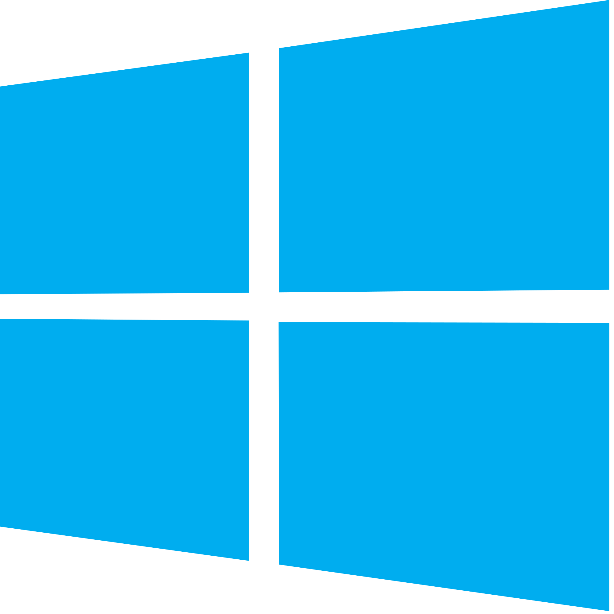

<style>

section {
  background-color: #fefefe;
  color: #333;
}

img[alt~="center"] {
  display: block;
  margin: 0 auto;
}
blockquote {
  background: #ffedcc;
  border-left: 10px solid #d1bf9d;
  margin: 1.5em 10px;
  padding: 0.5em 10px;
}
blockquote:before{
  content: unset;
}
blockquote:after{
  content: unset;
}

table {
  font-size: 30px;
}

ul {
  margin-top: 17px;
  margin-bottom: 17px;
}
</style>

<!-- _class: lead -->

# Module 1 : Les Fondamentaux 
## Les Conteneurs et Docker

*Formation Kubernetes - Débutant à Avancé*

---

## Sommaire du Module 1

- Qu'est-ce qu'un conteneur ?
- Docker a démocratisé les containers
- Dockerfile
- Docker Registry
- Commandes Docker essentielles
- **TP pratique** : Créer et publier votre image


---

## Qu'est-ce qu'un conteneur ?

> C'est une boite 📦

Ensemble de techniques qui vont permettre d'**isoler** un processus des autres processus, du système de fichiers et des ressources de l'hôte.

Il existe plein de technos pour isoler un processus : Docker est "juste" l'outil que a popularisé les containers Linux.

- voir aussi : [jail BSD](https://docs.freebsd.org/en/books/handbook/jails/), [zone Solaris](https://docs.oracle.com/cd/E19253-01/820-2318/zones.intro-1/index.html), [openVZ](https://openvz.org/), [LXC](https://linuxcontainers.org/), [container](https://learn.microsoft.com/fr-fr/virtualization/windowscontainers/about/) , [WASM](https://www.cncf.io/blog/2024/03/12/webassembly-on-kubernetes-from-containers-to-wasm-part-01/), ...

---

## Quelques différences containers vs VMs

- ➕ démarrage rapide (pas de matériel à émuler ou d'OS à démarrer)
- ➕ consommation souvent plus faible qu'une VM (*ça dépend*)
- ➖ partage du kernel (parfois problématique selon l'app)
- ➖ isolation plus faible (sécurité ---)
- ⚖️ **immuabilité**

ℹ️ Il existe des solution de type microVMs qui peuvent être un entre deux intéressant (ex : [Firecracker](https://firecracker-microvm.github.io/))

---

## Cas où la conteneurisation brille ✨

- **Microservices** : mutualisation des ressources d'un hôte
- Apps **stateless** (mise à l'échelle simple)
- **DevXP** : plus simple de construire un container qu'une VM
- Package *unique* censé fonctionner "partout"

> el famoso *"Build once, run anywhere"* 🚀


---

## Docker : démocratise les containers linux

[dotScale 2013 - Solomon Hykes - Why we built Docker](https://www.youtube.com/watch?v=3N3n9FzebAA)

- **Engine** : Runtime de conteneurs ([cgroups, namespaces](https://www.youtube.com/watch?v=sK5i-N34im8))
- **CLI** : Interface en ligne de commande (`docker`)
- **API** : Interface REST pour l'automatisation
- **Images** : Templates pour les conteneurs
- **Registry** : Stockage d'images (Docker Hub)
- **Compose/Swarm** : Orchestration simple
- **Desktop** : Interface graphique

---

## Dockerfile : recette d'un image bien faite 📝

- On créé un Dockerfile comme on écrirait un script d'installation
- Des opérations basiques sont listées (FROM, COPY, etc)
- L'ensemble de ces instructions donne une *image Docker*

```dockerfile
FROM node:24-alpine
WORKDIR /app
COPY package*.json ./
RUN npm install
COPY . .
EXPOSE 3000
CMD ["npm", "start"]
```

[Dockerfile reference](https://docs.docker.com/reference/dockerfile/)

---

## Installation Docker (1/2)

**Linux** : Docker Engine (gratuit)

```bash
# Script pour Ubuntu/Debian (à utiliser avec précaution)
curl -fsSL https://get.docker.com -o get-docker.sh
sudo sh ./get-docker.sh --dry-run
```


Ou via `apt` : [docs.docker.com/engine/install/ubuntu/#install-using-the-repository](https://docs.docker.com/engine/install/ubuntu/#install-using-the-repository)

---

## Installation Docker (2/2)

**Windows/macOS** : Pas de Docker natif
- [**Docker Desktop**](https://www.docker.com/products/docker-desktop/) (payant pour entreprises > 250 employés)
- **Alternatives** : [Podman](https://podman.io/), [OrbStack](https://orbstack.dev/) (payant), [Lima VM](https://github.com/lima-vm/lima) / [Colima](https://github.com/abiosoft/colima)...

```bash
# Podman comme "drop-in replacement"
alias docker=podman
```

> Pour ce module : Docker Desktop ou Podman suffisent

---

## Système de fichiers en couches

Docker utilise un **système de fichiers en couches** (layered FS) :

- Chaque instruction du Dockerfile = une **couche** (layer)
- Les couches sont **empilées** et **immuables**
- **Réutilisation** : les images peuvent partager des couches communes
- **Optimisation** : seules les couches modifiées sont re-téléchargées
- **Cache intelligent** : Docker réutilise les couches non modifiées lors des rebuilds

---

## Schéma d'une image docker à 5 couches

```
┌─────────────────┐
|     couche 5    | ← Couche application  (RW)  ▲
┌─────────────────┤                             |
|     couche 4    | ← COPY . .                  |
├─────────────────┤                             |
|     couche 3    | ← RUN npm install           |
├─────────────────┤                             |
|     couche 2    | ← COPY package.json         |
├─────────────────┤                             |
|     couche 1    | ← FROM node:24-alpine (RO)  |
└─────────────────┘
```

---

## Docker Registry : Le magasin d'images

- **[Docker Hub](https://hub.docker.com/)** : Registry public par défaut (payant sauf pour les individus et certains projets OSS)
- **Registry privé** : Pour vos images internes

ℹ️ En prod, avoir un *proxy* (ex. [Harbor](https://goharbor.io/)) ou un *cache d'images* ([spegel](https://github.com/spegel-org/spegel)) pour se prémnir des  risques disponibilité / rate limiting

```bash
# Publier une image
docker push mon-registry/mon-app:v1.0

# Récupérer une image
docker pull nginx:latest
```

---

## Télécharger une images avec multi-couches

```bash
$ docker pull nginx:latest
latest: Pulling from library/nginx
31b3f1ad4ce1: Pulling fs layer
fd42b079d0f8: Pulling fs layer  
18f4ffdd1b9d: Pulling fs layer
18f4ffdd1b9d: Waiting
fd42b079d0f8: Download complete
31b3f1ad4ce1: Download complete
18f4ffdd1b9d: Download complete
31b3f1ad4ce1: Pull complete
fd42b079d0f8: Pull complete
18f4ffdd1b9d: Pull complete
Digest: sha256:67f9a4f10d147a6e04629340e6493c9703300ca23a2f7f3aa56fe615d75d31ca
Status: Downloaded newer image for nginx:latest
```

---

## Démarrer son premier container

```bash
# Lancer un conteneur qui liste le répertoire courant
$ docker run -v $(pwd):/app ubuntu:24.04 ls -la /app
total 16
-rw-r--r-- 1 root root 1234 Jul 16 10:30 README.md
drwxr-xr-x 3 root root   96 Jul 16 10:30 Support
drwxr-xr-x 3 root root   96 Jul 16 10:30 TP
```

> `-v $(pwd):/app` = répertoire courant monté dans `/app`

Utile pour utiliser un binaire sans l'installer

---

## Démarrer un container en mode "interactif"

```bash
# Lancer Python directement sans l'installer
$ docker run -it python:3.13 python
Python 3.13.0 (main, Oct  8 2024, 22:15:05) [GCC 12.2.0] on linux
Type "help", "copyright", "credits" or "license" for more information.
>>> print("Hello from container!")
Hello from container!
>>> exit()
```

> `-it` = **i**nteractif + pseudo-**t**ty

---

## Démarrer un container en tâche de fond

```bash
# Lancer nginx en mode daemon (-d = detached)
$ docker run -d -p 8080:80 --name mon-nginx nginx:latest
a1b2c3d4e5f6789...

$ docker ps
CONTAINER ID   IMAGE          COMMAND                  CREATED
a1b2c3d4e5f6   nginx:latest   "/docker-entrypoint.…"   2 seconds ago
```

> `-d` = detached, `-p` = port mapping, `--name` = nom du conteneur

---

## Lancer une commande dans un container

```bash
# Se connecter au conteneur en cours d'exécution
$ docker exec -it mon-nginx /bin/bash
root@a1b2c3d4e5f6:/# nginx -v
nginx version: nginx/1.25.3
root@a1b2c3d4e5f6:/# exit
```

ℹ️ *Cette foncitonnalité nécessite que le container soit "up", et que le binaire (ici `/bin/bash`) soit présent dans l'image

---

## Commandes Docker essentielles (1/2)

```bash
# Construire une image
docker build -t mon-app:v1.0 .

# Lancer un conteneur
docker run -d -p 8080:3000 mon-app:v1.0

# Voir les logs
docker logs <container-id>

# Accéder au conteneur
docker exec -it <container-id> /bin/bash
```

---

## Commandes Docker essentielles (2/2)

```bash
# Lister les images locales
docker images

# Lister les conteneurs en cours (ajouter -a pour voir ceux arrêtés)
docker ps

# Arrêter un conteneur
docker stop <container-id>

# Supprimer un conteneur
docker rm <container-id>

# Supprimer une image
docker rmi <image-id>
```

---

<!-- _class: lead -->

# Aller plus loin

---

## Desktop, Compose, Swarm

Quelques outils supplémentaires développé par Docker Inc.

- [**Docker Desktop** - Interface graphique pour développeurs (Windows/Mac)](https://www.docker.com/products/docker-desktop/)
- [**Compose : multi-conteneurs avec YAML** - `docker-compose up`](https://docs.docker.com/compose/)
- [**Swarm : clustering natif Docker** - Alternative basique à Kubernetes](https://docs.docker.com/engine/swarm/)

> K8s reste **le** standard pour l'orchestration de containers

---

<!-- _class: lead -->

# TP 1 : Votre première image Docker

---

## Objectif du TP : créer et publier votre propre image Docker

A partir d'un serveur web Python simple :

1. Créer un Dockerfile
2. Construire l'image
3. La lancer en local
4. La publier sur GitHub Container Registry

Allez dans le dossier `TP/1/instructions/`


---

<!-- _class: lead -->

## Questions ? 🤔

*Prêts pour passer à Kubernetes ?*


---

## Bibliographie (1/2)

Documentation officielle :

- [Docker Documentation](https://docs.docker.com/)
- [Dockerfile Reference](https://docs.docker.com/reference/dockerfile/)
- [Docker Engine Install](https://docs.docker.com/engine/install/)

---

## Bibliographie (2/2)

Talks :

- [dotScale 2013 - Solomon Hykes - Why we built Docker](https://www.youtube.com/watch?v=3N3n9FzebAA)
- [DockerCon EU 2021 - Jérôme Petazzoni - Cgroups, namespaces, and beyond](https://www.youtube.com/watch?v=sK5i-N34im8)

Ressources d'apprentissage complémentaires :

- [Introduction to Docker and Containers](https://qconsf2017intro.container.training/#1)
- [github.com/jpetazzo/container.training](https://github.com/jpetazzo/container.training)