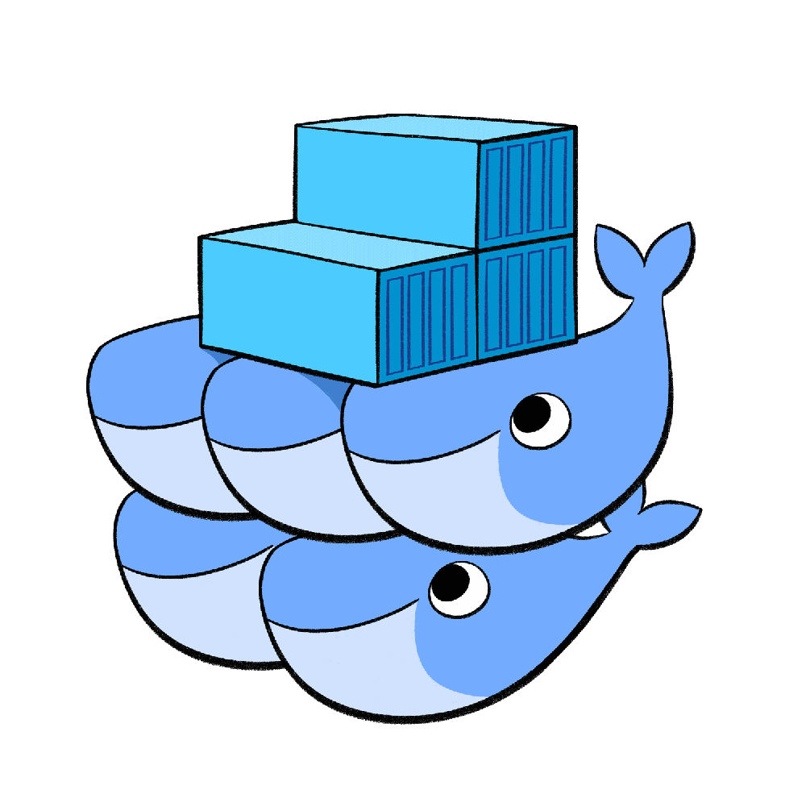
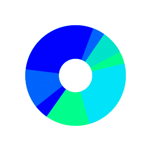
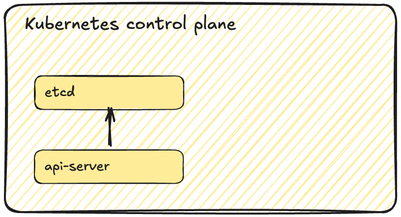
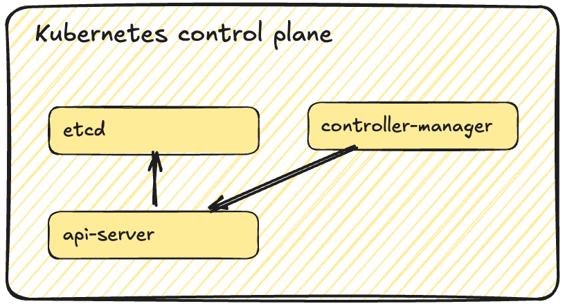
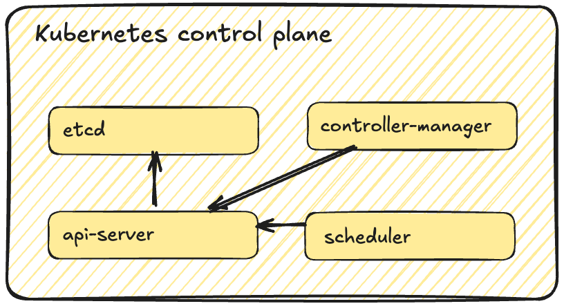
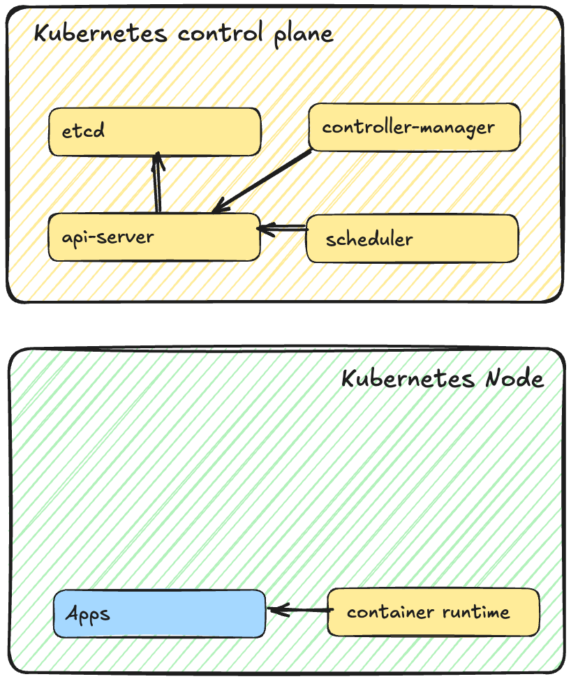
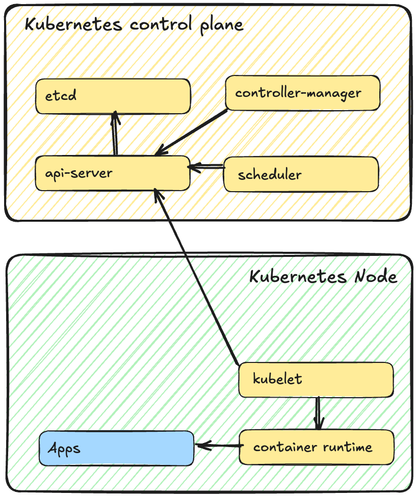
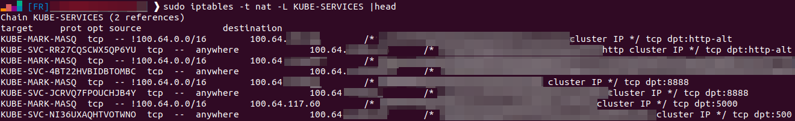
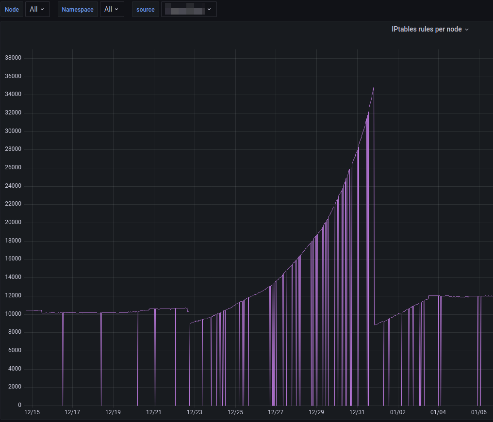
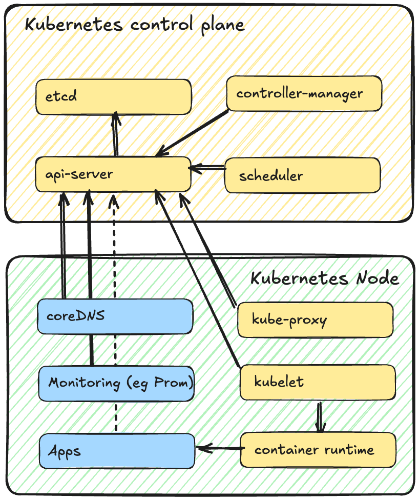

<style>

section {
  background-color: #fefefe;
  color: #333;
}

img[alt~="center"] {
  display: block;
  margin: 0 auto;
}
blockquote {
  background: #ffedcc;
  border-left: 10px solid #d1bf9d;
  margin: 1.5em 10px;
  padding: 0.5em 10px;
}
blockquote:before{
  content: unset;
}
blockquote:after{
  content: unset;
}
</style>

<!-- _class: lead -->

# Module 2 : Comprendre Kubernetes
## Architecture et composants internes

*Formation Kubernetes - Débutant à Avancé*

---

## Sommaire du Module 2

- C'est quoi Kubernetes ? Pourquoi on l'utilise ? Comment le déployer ?
- Concepts clés de Kubernetes
- Le Control Plane (Master)
- Les Nodes (Workers)


---

## Mais c'est **quoi**, Kubernetes ?

> Docker engine, c'est bien ! Mais "en tant qu'ops", je ne veux pas gérer manuellement des containers docker sur des serveurs linux


- Orchestrateur de containers, inspiré par un outil interne de Google
- Open sourcé et donné à la [CNCF](https://www.cncf.io/) en 2015
- A *gagné* la "guerre des orchestrateurs" 
  -  Docker swarm
  -  Mesos Marathon


---

## Pourquoi Kubernetes ?

**Les promesses de l'orchestration :**

- **Haute disponibilité** native des applications
- **Gestion du cycle de vie** des applications et de leur mise à l'échelle
- **Infrastructure as Code** avec des APIs et du YAML
- **Extensibilité** pour s'adapter à tous les besoins

> Kubernetes = "Greek for **helmsman** of a ship"

---

## Comment déployer Kubernetes ?

Quelques Kubernetes managés :
- **[AWS EKS](https://aws.amazon.com/fr/eks/)**, **[Azure AKS](https://azure.microsoft.com/fr-fr/products/kubernetes-service)**, **[Google GKE](https://cloud.google.com/kubernetes-engine?hl=fr)**, **[OVH Managed Kubernetes](https://www.ovhcloud.com/fr/public-cloud/kubernetes/)**, ...

Quelques outils d'installation :
- [**kubeadm**](https://kubernetes.io/fr/docs/setup/production-environment/tools/kubeadm/install-kubeadm/) : Outil officiel pour bootstrapper un cluster
- [**Kubespray**](https://kubernetes.io/fr/docs/setup/custom-cloud/kubespray/) : Déploiement via Ansible
- **[k3s](https://k3s.io/) / [k0s](https://k0sproject.io/)** : Binaires uniques "tout en un"
- **[Talos Linux](https://www.talos.dev/) / [Kairos](https://kairos.io/)** : OS immutables conçus pour Kubernetes

---

<!-- _class: lead -->

# Concepts clés
## Les principes fondamentaux

---

## Tout est API et YAML (1/2)

Dans Kubernetes, **toutes** les ressources sont des objets API !

```bash
# Applications, Reverse proxy, configuration, volumes... tout !
kubectl api-resources
NAME                                SHORTNAMES                          APIVERSION                        NAMESPACED   KIND
bindings                                                                v1                                true         Binding
componentstatuses                   cs                                  v1                                false        ComponentStatus
configmaps                          cm                                  v1                                true         ConfigMap
endpoints                           ep                                  v1                                true         Endpoints
events                              ev                                  v1                                true         Event
limitranges                         limits                              v1                                true         LimitRange
namespaces                          ns                                  v1                                false        Namespace
nodes                               no                                  v1                                false        Node
persistentvolumeclaims              pvc                                 v1                                true         PersistentVolumeClaim
persistentvolumes                   pv                                  v1                                false        PersistentVolume
pods                                po                                  v1                                true         Pod
```
---

## Tout est API et YAML (2/2)

**Les humains interagissent avec Kubernetes via du YAML** *(ou JSON)*

```yaml
# Exemple simplifié d'une application (en détail dans le module 3)
apiVersion: apps/v1
kind: Deployment
metadata:
  name: mon-app
spec:
  replicas: 3
```

> **Comprendre :** Kubernetes = base de données d'objets + contrôleurs qui agissent

---

## Boucles de réconciliation (1/2)

```
┌─────────────┐    ┌──────────────┐    ┌──────────────┐
│   Observer  │───>│   Comparer   │───>│    Agir      │
│ l'état réel │    │ avec souhaité│    │ si nécessaire│
└─────────────┘    └──────────────┘    └──────────────┘
       ▲                                       │
       └───────────────────────────────────────┘
                On boucle à l'infini
```

- **Auto-réparation** : Redémarre les applications crashés
- **Convergence** : Réatteindre l'état souhaité après une panne
- **Idempotence** : Appliquer plusieurs fois = même résultat

---

## Boucles de réconciliation (2/2)

```yaml
# État souhaité (déclaré dans YAML)
spec:
  replicas: 3
  template:
    spec:
      containers:
      - image: nginx:1.29
# État réel (observé dans le cluster)  
status:
  replicas: 2        # Il manque 1 Pod !
  readyReplicas: 2
```

> **Le contrôleur crée un 3ème Pod pour atteindre l'état souhaité**

---

## API et versions des API (1/2)

Les objets logiques de Kubernetes sont décrits par des APIs.

Pour s'assurer de la compatibilité des APIs tout en permettant leur évolution, les APIs de Kubernetes sont versionnées :

```bash
# Lister toutes les APIs disponibles
kubectl api-resources

# Exemples d'APIs
v1                   # Core API (stable)
apps/v1              # Deployments, ReplicaSets
networking.k8s.io/v1 # NetworkPolicies, Ingress
```

---

## API et versions des API (2/2)

**Évolution des APIs :**
- **alpha** : `v1alpha1` (instable, tout peut changer)
- **beta** : `v1beta1` (data stable, mais le reste peut évoluer)  
- **stable** : `v1` (garantie de compatibilité)

⚠️ les versions d'APIs peuvent devenir "deprecated", et finir par **ne plus fonctionner** sur une version ultérieure de Kubernetes

[Kubernetes - API changes](https://kubernetes.io/docs/concepts/overview/kubernetes-api/#api-changes)
[Kubernetes - Deprecated API Migration Guide](https://kubernetes.io/docs/reference/using-api/deprecation-guide/)

---

## Extensibilité

**Kubernetes est conçu pour être étendu**

**Custom Resource Definitions (CRDs) :**
```yaml
apiVersion: apiextensions.k8s.io/v1
kind: CustomResourceDefinition
metadata:
  name: applications.example.com
spec:
  group: example.com
  versions:
  - name: v1
    served: true
    storage: true
```

**Operators :** CRD + Controller personnalisé
**Exemples :** Prometheus Operator, Istio, ArgoCD

> **Kubernetes = plateforme pour construire des plateformes**

---

<!-- _class: lead -->

# Le Control Plane

---

## etcd 

**Base de données clé/valeur distribuée**

- **Stockage** : Toute la configuration et l'état du cluster
- **Consistency** : Algorithme de consensus Raft
- **Fault-tolerant** : Réplication sur plusieurs nœuds (3, 5, 7...)

```bash
# Exemple de données dans etcd
/registry/deployments/default/mon-app
/registry/services/default/mon-service
/registry/pods/default/mon-pod-abc123
```

---

## API Server (1/2)

**Point d'entrée unique pour toutes les opérations**

- **Validation** : Vérifie la syntaxe et les permissions
- **Persistance** : Sauvegarde dans etcd
- **Notification** : Informe les autres composants des changements
- **Extensibilité** : Support de *Custom Resource Definitions* (CRDs)



---

## API Server (2/2)

La manière la plus simple d'interagir avec le serveur d'API de Kubernetes est d'utiliser la CLI `kubectl`


```bash
# Toutes les commandes kubectl passent par l'API server
kubectl get pods → GET /api/v1/pods
kubectl create -f deploy.yaml → POST /api/v1/deployments
```


---

## Controller Manager : les boucles de contrôle

Programme qui pilote les contrôleurs. 

Les controllers surveillent l'état souhaité de divers types de ressources logiques de Kubernetes :

```
boucle infinie:
  état_actuel = observer_cluster()
  état_souhaité = lire_configuration()
  si état_actuel != état_souhaité:
    agir_pour_corriger()
  attendre(court_instant)
```

[kubernetes.io/docs/concepts/architecture/controller](https://kubernetes.io/docs/concepts/architecture/controller/#controller-pattern)

---

## Quelques exemples de contrôleurs

- **Deployment Controller** : gère les ReplicaSets
- **ReplicaSet Controller** : maintient le nombre de Pods
- **Endpoint Controller** : met à jour les Services



---

## Scheduler : optimise le placement des apps


- **Ressources disponibles sur le Node** : CPU, RAM, stockage
- **Contraintes** : nodeSelector, affinity/anti-affinity
- **Taints et tolerations** : exclusions et autorisations
- **Répartition** : éviter la concentration sur un seul Node



---

## Focus : ressources d'un Node (1/2)

**Chaque Node a des limites physiques et logicielles :**

```yaml
# Exemple de capacités d'un Node
status:
  capacity:
    cpu: "4"                    # 4 vCPUs
    memory: "8Gi"               # 8 GB RAM  
    hugepages-2Mi: "0"          # Huge pages
    pods: "110"                 # Max pods par Node
  allocatable:                  # Disponible pour les Pods
    cpu: "3800m"               # Réservé pour kubelet/OS
    memory: "7.5Gi"
    pods: "110"
```

---

## Focus : ressources d'un Node (2/2)

Au delà de la quantité de CPU / RAM, il faut garder en tête que les nodes sont des serveurs avec :
- **Max pods/Node** : 110 par défaut (configurable)
- **CIDR constraints** : Nombre d'IPs disponibles pour les containers
- **Storage** : taille max des volumes locaux (éphémères ou non)

---

<!-- _class: lead -->

# Les Nodes

---

## Container Runtime, exécute les containers

- **Docker** (voir [cri-dockerd](https://github.com/Mirantis/cri-dockerd))
- [**containerd** (CNCF graduated)](https://containerd.io/)
- [**CRI-O** (CNCF graduated)](https://cri-o.io/)
- [**Kata Containers** (microVM)](https://katacontainers.io/)

```bash
# Interface Container Runtime Interface (CRI)
crictl ps              # Lister les conteneurs
crictl images          # Lister les images
crictl logs <id>       # Voir les logs
```



---

## kubelet : l'agent

- Communication avec l'API server
- Pilote le container runtime
- Gestion des Pods (création, **surveillance**, suppression)
  - Liveness et Readiness probes

```bash
# Le kubelet expose aussi des métriques sur le Node
curl http://node:10250/metrics
```



---

## kube-proxy

Composant ***optionnel*** qui permet de gérer une partie du réseau de Kubernetes (Service)

Il existe plusieurs modes de fonctionnement mais le mode par défaut (`iptables`) souffre de limitations graves :




---

## kube-proxy : limitations

***iptables** n'est pas conçu pour gérer des dizaines de milliers de règles*

**iptables** devient lent si on augmente le nombre de containers (Pod / Services), au point de pouvoir bloquer un **Node**



---

## Récap : architecture de Kubernetes

En simplifiant (beaucoup) :

> un serveur d'API
> \+ un ordonnanceur
> \+ des boucles de contrôle
> \+ un container runtime
> \+ du réseau




---

## Aller plus loin

Pour comprendre en détail les fonctionnement interne de Kubernetes, le mieux reste encore de **tester soi-même** !

Le dépôt suivant contient un tutoriel et des scripts pour "construire" un cluster Kubernetes, binaire par binaire :
- [github.com/zwindler/demystifions-kubernetes](https://github.com/zwindler/demystifions-kubernetes)

Une version talk 40 minutes est également disponible :
- [Cloud Nord  - Démystifions les composants internes de Kubernetes](https://www.youtube.com/watch?v=Zv54GvQT6hI)

---

<!-- _class: lead -->

# TP 2 : Installer Kubernetes en local

---

## Objectif du TP : installer un cluster Kubernetes local

Pour tester les concepts vus dans ce module et préparer la suite :

1. Installer kind (Kubernetes in Docker)
2. Installer kubectl (CLI Kubernetes)
3. Créer votre premier cluster
4. Tester avec un pod nginx

Allez dans le dossier `TP/module-2/instructions/`

---

<!-- _class: lead -->

## Questions ?

*Prêts à découvrir les ressources de base ?*


---

## Bibliographie

- [Kubernetes Official Documentation](https://kubernetes.io/docs/)
- [Kubernetes The Hard Way - Kelsey Hightower](https://github.com/kelseyhightower/kubernetes-the-hard-way)
- [Kubernetes Deconstructed - Carson Anderson](https://www.youtube.com/watch?v=90kZRyPcRZw)
- [Kubernetes documentation - Considerations for large clusters
](https://kubernetes.io/docs/setup/best-practices/cluster-large/)