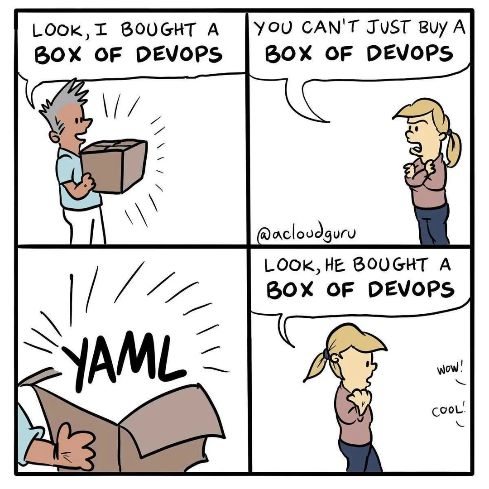
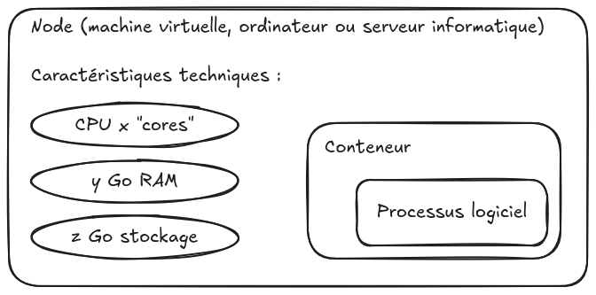
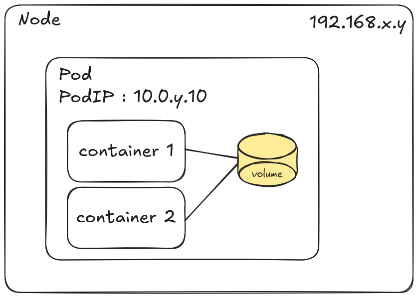

<style>

section {
  background-color: #fefefe;
  color: #333;
}

img[alt~="center"] {
  display: block;
  margin: 0 auto;
}
blockquote {
  background: #ffedcc;
  border-left: 10px solid #d1bf9d;
  margin: 1.5em 10px;
  padding: 0.5em 10px;
}
blockquote:before{
  content: unset;
}
blockquote:after{
  content: unset;
}
</style>

<!-- _class: lead -->

# Module 3 : Ressources de base
## Les objets essentiels de Kubernetes

*Formation Kubernetes - Débutant à Avancé*

---

## Plan du Module 3

**Partie 1 : YAML et `kubectl`**
- Structure des manifests, métadonnées, namespaces, `.kube/config`
- Commandes `kubectl` et gestion courante

**Partie 2 : Les ressources Kubernetes**  
- Nodes, Namespaces, Pods, Deployments, Services
- ConfigMaps, Secrets, Volumes, Ingress


---

<!-- _class: lead -->

# Partie 1 : YAML et `kubectl`

---

## YAML Ain't Markup Language

- Structure hiérarchique par espaces
- **Human readable**
- **Standard** dans les outils Cloud Native

Dans , les objets sont généralement décrits en YAML par les utilisateurs, mais sont stockés et transmis en JSON par l’API.

> Nous allons manipuler **énormément** de fichiers YAML !



---

## Structure d'un manifest YAML pour K8s

**Tout objet Kubernetes suit la même structure :**

```yaml
apiVersion: v1           # Version de l'API à utiliser
kind: Pod                # Type de ressource Kubernetes
metadata:                # Métadonnées de l'objet
  name: mon-objet
  namespace: default
  # ...
spec:                    # Configuration souhaitée
  # ... configuration spécifique en fonction du type
status:                  # État actuel (géré par Kubernetes)
  # ... état de l'objet (lecture seule)
```

**4 sections obligatoires :** `apiVersion`, `kind`, `metadata`, `spec`

---

## Métadonnées : Organisation et identification

```yaml
metadata:
  namespace: production         # Isolation logique
  name: nginx-web-server        # Nom (unique dans le namespace)
  labels:                       # Étiquettes pour sélection/groupement
    app: nginx
    component: web-server
    version: "1.29"
    env: production
    team: frontend
  annotations:                  # Métadonnées non-sélectionnables
    deployment.kubernetes.io/revision: "3"
    description: "Serveur web principal"
```

---

## Focus : labels vs annotations (1/2)

**Labels :**
- **Sélection** : utilisés par les contrôleurs et services (`selector:`)
- **Filtrage** : requêtes avec `kubectl get -l`
- **Limitations** : 63 (max) caractères [`a-zA-Z0-9-_.`] 
- **Exemples** : `app=nginx`, `env=production`, `version=v1.2`

> **Note :** Les labels peuvent être immuables selon le type de ressource

---

## Focus : labels vs annotations (2/2)

**Annotations :**
- **Documentation** : descriptions, notes, métadonnées riches
- **Outils** : configuration pour ingress, monitoring, CI/CD
- **Liberté** : pas de limite de caractères, tous caractères autorisés
- **Exemples** : URLs, JSON, descriptions longues

**Ce sont donc deux types de métadonnées avec des usages différents !**

---

## Namespaces dans les manifests (1/2)

Certaines ressources peuvent être organisées en "namespaces". D'autres sont "cluster wide".

```yaml
# Exemple du manifest d'un Namespace
apiVersion: v1
kind: Namespace
metadata:
  name: development
  labels:
    env: dev
    team: backend
```

---

## Namespaces dans les manifests (2/2)

Pour un type donné (de ressource "namespacée"), `name: <valeur>` doit être unique dans le *Namespace*

**Bonne pratique :** spécifiez **toujours** le *namespace* d'une ressource

```yaml
apiVersion: v1
kind: Pod
metadata:
  name: nginx-pod
  namespace: development                                                             
spec:
  containers:
  - name: nginx
    image: nginx:1.29
```


---

## kubeconfig : le fichier de connexion

Structure logique :
```
kubeconfig
├── clusters         # Définition des clusters (URL, certificats)
├── users            # Identifiants et authentification
├── contexts         # Association cluster + user + namespace
└── current-context  # Contexte actif
```

**Emplacement :** `~/.kube/config` (par défaut)


---

## kubeconfig (2/2)

```yaml
apiVersion: v1
kind: Config
clusters:
- cluster:
    certificate-authority-data: LS0tLS1CRU...
    server: https://kubernetes.example.com:6443 # URL de l'api-server
  name: prod-cluster
contexts:
- context:
    cluster: prod-cluster
    user: admin
    namespace: webapp # Namespace par défaut de ce contexte
  name: prod-admin
current-context: prod-admin
users:
- name: admin
  user:
    client-certificate-data: LS0tLS1CRU...
    client-key-data: LS0tLS1CRU...
```


---

## kubectl : état du cluster

**Maintenant que nous comprenons les manifests, manipulons-les :**

```bash
# Informations sur le cluster
kubectl version                    # Versions client/serveur
kubectl cluster-info               # Infos du cluster

# Explorer les APIs disponibles
kubectl api-resources              # Toutes les ressources
kubectl api-versions               # Versions d'API disponibles
```

---

## kubectl : commandes génériques

```bash
# Commandes génériques (fonctionne avec toute ressource)
kubectl get <type>                # Lister des ressources
kubectl describe <type> <nom>     # Détails d'une ressource
kubectl create -f <fichier>       # Créer depuis un fichier
kubectl apply -f <fichier>        # Appliquer (recommandé)
kubectl delete <type> <nom>       # Supprimer une ressource
```

---

## Gestion des contextes et namespaces

```bash
# Gestion des contextes
kubectl config get-contexts                      # Liste tous les contextes
kubectl config current-context                   # Contexte actuel
kubectl config use-context prod-admin            # Changer de contexte

# Gestion des namespaces
kubectl config set-context --current --namespace=production
kubectl get namespaces                           # Lister tous les namespaces

kubectl get <type> --namespace production        # ou -n production
kubectl get <type> --all-namespaces              # ou -A
```

**Note :** tools `kubectx` et `kubens` facilitent le changement de contexte / namespace.

---

## Sélecteurs et labels avec kubectl

```bash
# Utiliser les labels pour filtrer
kubectl get <type> -l app=nginx                  # ressouces avec label app=nginx
kubectl get <type> -l app=nginx,env=production   # ET logique
kubectl get <type> -l 'env in (dev,staging)'     # OU logique
kubectl get <type> -l app!=nginx                 # Négation

# Afficher les labels
kubectl get <type> --show-labels                 # Voir tous les labels
kubectl get <type> -L app,env                    # Colonnes spécifiques

# Modifier les labels
kubectl label <type> ma-ressource version=v2     # Ajouter/modifier
kubectl label <type> ma-ressource version-       # Supprimer "version"
```

---

## Formats de sortie et débogage

```bash
# Formats d'affichage
kubectl get <type> -o wide                  # Plus de détails
kubectl get <type> -o yaml                  # Format YAML complet
kubectl get <type> -o json                  # Format JSON
kubectl get <type> -o jsonpath='{.items[0].metadata.name}'

kubectl describe <type> ma-ressource        # Détails sur une ressource

# Débogage
kubectl logs mon-pod                        # Logs du conteneur
kubectl exec -it mon-pod -- /bin/bash       # Shell interactif

# Suivi en temps réel
kubectl get <type> --watch                  # ou -w
kubectl logs -f mon-pod                     # Logs en temps réel d'un "pod"
```

---

## Astuces kubectl (1/2)

**Commandes utiles pour toute ressource :**

```bash
# Générer le manifest YAML d'une ressource, sans la créer
kubectl create <type> <nom> --dry-run=client -o yaml

# Éditer en direct une ressource existante
kubectl edit <type> <nom>

# Récupérer le manifest d'une ressource existante
kubectl get <type> <nom> -o yaml > backup.yaml

# Surveiller les événements
kubectl get events --watch
kubectl get events --sort-by='.lastTimestamp'
```

---

## Astuces kubectl (2/2)

Aide contextuelle sur les ressources

```bash
kubectl explain <type>           # Documentation du type
kubectl explain <type>.<champ>   # Documentation d'une section
```

```bash
$ kubectl explain pod.metadata.name 
KIND:       Pod
VERSION:    v1

FIELD: name <string>

DESCRIPTION:
    Name must be unique within a namespace. Is required when creating resources,
    although some resources may allow a client to request the generation of an
    appropriate name automatically. Name is primarily intended for creation
    idempotence and configuration definition. Cannot be updated. More info:
    https://kubernetes.io/docs/concepts/overview/working-with-objects/names#names                      
```

---

## Première exploration du cluster (cf module 2)

```bash
# Quels types de ressources sont disponibles ?
kubectl api-resources

# Qu'est-ce qui tourne dans le cluster ?
kubectl get all -A

# Les namespaces système
kubectl get namespaces

# Les nœuds du cluster
kubectl get nodes -o wide
```

---

<!-- _class: lead -->

# Partie 2 : Les ressources Kubernetes
## Les objets logiques pour construire nos applications

---

## Nodes (rappel module 2)

Serveur informatique qui va exécuter nos containers

```bash
Capacity:
  cpu:                2
  ephemeral-storage:  100476656Ki
  memory:             8113864Ki
  pods:               110
Allocatable:
  cpu:                2
  ephemeral-storage:  100476656Ki
  memory:             8113864Ki
  pods:               110
```



---

## Nodes : gestion de base


```bash
$ kubectl get nodes
NAME                          STATUS   ROLES           AGE   VERSION
tp-kubernetes-control-plane   Ready    control-plane   24h   v1.32.2
tp-kubernetes-worker          Ready    <none>          24h   v1.32.2
tp-kubernetes-worker2         Ready    <none>          24h   v1.32.2
```

**États possibles :** Ready, NotReady, Unknown

**Préparation pour les maintenances :** (un)cordon et drain

```bash
$ kubectl cordon tp-kubernetes-worker    # Bloque le scheduling
$ kubectl drain tp-kubernetes-worker     # Vide le node de ses pods
```

---

## Namespaces : Isolation et organisation (1/2)


Quelques *patterns* classiques de découpage par namespaces :

- Par environnements : `development`, `staging`, `production`
- Par équipes : `team-frontend`, `team-backend`, `team-data`  
- Par applications : `wordpress`, `monitoring`, `logging`
- Par clients : `client-a`, `client-b`

**Conseil** : choisissez une stratégie et restez cohérent !

---

## Namespaces : Isolation et organisation (2/2)

**Isolation fournie :**
- **Noms** : deux ressources d'un même type **peuvent** avoir le même nom dans des namespaces **différents**
- **Quotas** : limites CPU/RAM/stockage par namespace
- **Réseau** : avec de la configuration supplémentaires, on peut rajouter du filtrage réseau par namespace (cf **module 5**)
- **RBAC** : permissions d'accès par namespace (cf **module 6**)

---

## Commandes pour les namespaces

```bash
# Créer un namespace
kubectl create namespace production
kubectl apply -f namespace.yaml

# Argument "-n/--namespace" pour forcer un namespace explicitement
kubectl get pods -n development
kubectl apply -f app.yaml -n development

# Définir un namespace par défaut sur le contexte
kubectl config set-context --current --namespace=development
```

---

## Pod : l'unité d'exécution

Groupe de conteneurs qui partagent :
- même adresse IP et ports  
- même volumes accessibles

Autres caractéristiques :
- Créés et détruits ensemble
- Entité éphémère
- Unité atomique



---

## Pods : exemple de manifest

```yaml
apiVersion: v1
kind: Pod
metadata:
  name: nginx-pod
spec:
  containers:
  - name: nginx
    image: nginx:1.29
    ports:
    - containerPort: 80
```

ℹ️ On créera rarement "directement" des Pods sur un cluster Kubernetes. Il existe d'autres ressources de plus haut niveau.

---

## Cycle de vie d'un Pod

États d'un Pod :

- **Pending** : en attente (scheduling, volume manquant, ...)
- **Running** : au moins un conteneur s'exécute
- **Succeeded** : tous les conteneurs se sont terminés avec succès
- **Failed** : au moins un conteneur a échoué
- **Unknown** : État du Pod indéterminable

---

## Commandes pour les Pods

```bash
# Voir l'état des Pods
kubectl get pods
kubectl get pods -o wide            # Plus de détails
kubectl describe pod nginx-pod

# Logs et debug
kubectl logs nginx-pod
kubectl logs nginx-pod -f           # En temps réel
kubectl exec -it nginx-pod -- bash  # Se connecter au Pod
```

---

## Deployments : orchestration des Pods

Contrôleur de haut niveau pour gérer des applications

- **Déclaratif** : définition de l'état souhaité (image, replicas...)
- **Rolling updates** : mises à jour sans interruption de service
- **Rollback** : retour à une version précédente
- **Versioning** : historique des déploiements

> **En pratique :** Le Deployment délègue la gestion des Pods aux ReplicaSets (qu'on verra après)

---

## Deployment : exemple de manifest

```yaml
apiVersion: apps/v1
kind: Deployment
metadata:
  name: nginx-deployment
spec:
  replicas: 3            #<----- nombre de Pods correspondant au spec.template qu'on veut gérer    
  selector:
    matchLabels:
      app: nginx
  template:              #<----- spec.template est équivalent à la définition complète du Pod
    metadata:
      labels:
        app: nginx
    spec:                #<----- spec.template.spec est équivalente à la spec du Pod
      containers:
      - name: nginx
        image: nginx:1.29
        ports:
        - containerPort: 80
```

---

## Deployments : opérations courantes

```bash
# Créer un deployment (déclaratif)
kubectl create deployment nginx --image=nginx:1.29

# Changer l'état souhaité (scaling - délégué au ReplicaSet)
kubectl scale deployment nginx --replicas=5

# Changer la version (rolling update - nouveau ReplicaSet)
kubectl set image deployment/nginx nginx=nginx:1.29.1

# Gestion du versioning
kubectl rollout history deployment/nginx    # Voir les versions
kubectl rollout undo deployment/nginx       # Rollback (ancien ReplicaSet)        
kubectl rollout status deployment/nginx     # Suivi du déploiement

# Pour voir les ReplicaSets gérés par les Deployments
kubectl get rs 
```

---

## ReplicaSets : la gestion opérationnelle

**Les Deployments délèguent la gestion des Pods aux ReplicaSets :**

- **Réplicas** : Maintient le nombre exact de Pods en vie
- **Scaling** : Augmentation/diminution en temps réel
- **Template** : Utilise le modèle de Pod du Deployment
- **Sélection** : Trouve et gère les Pods via les labels

> **Rolling update :** Deployment crée un nouveau ReplicaSet, supprime l'ancien


---

## Autres contrôleurs de Pods

Au-delà des Deployments, d'autres contrôleurs gèrent des Pods :

- **DaemonSet** : un Pod par Node (monitoring, logs, stockage...)
- **StatefulSet** : Pods avec identité stable (bases de données, Kafka...)
- **Job** : tâches ponctuelles (migrations, calculs batch...)
- **CronJob** : tâches programmées (sauvegardes, nettoyage...)

> **Principe :** chaque contrôleur répond à un besoin spécifique d'orchestration

---

## Services

Les Pods sont des entités **éphémères**. Il faut donc une ressource capable de découvrir les Pods "vivants" et leur servir le trafic.

- **Load balancing** : répartit le trafic entre les Pods cibles
- **Nom DNS stable** : `<nomsvc>.<namespace>.svc.cluster.local`
- **Service discovery**  : trouve automatiquement les Pods cibles grâce aux labels

```yaml
spec:
  selector:
    app: nginx
```

---

## Les types de Services

Il existe plusieurs types de Services dans Kubernetes :

- **ClusterIP** : accès interne uniquement (défaut)
- **NodePort** : expose sur un port de chaque Node
- **LoadBalancer** : alloue une IP externe (souvent via un Loadbalancer chez un cloud provider)
- **ExternalName** : alias DNS vers un service externe
- Exception : **headless** (`ClusterIP: None`), pas de load balancing, résolution DNS directe vers les Pods (utilisé par *StatefulSets*)

---

## Service : exemple de manifest ClusterIP

Le Service n'est accessible qu'au sein du cluster, soit via son nom `<nomsvc>.<namespace>.svc.cluster.local`, soit via la ClusterIP affectée

```yaml
apiVersion: v1
kind: Service
metadata:
  name: nginx-service
spec:
  selector:          #<----- vers quels pods le service doit router le traffic ?
    app: nginx
  ports:
  - port: 80         #<----- port en frontal du Service
    targetPort: 80   #<----- port cible vers le container du Pod
  type: ClusterIP
```

---

## Service : exemple de manifest NodePort

En plus de la ClusterIP, le port 30080 est exposé sur TOUS les Nodes du cluster et redirige vers le port 80 du Service

```yaml
apiVersion: v1
kind: Service
metadata:
  name: nginx-nodeport
spec:
  selector:
    app: nginx
  ports:
  - port: 80
    targetPort: 80
    nodePort: 30080        #<----- port exposé sur tous les Nodes                
  type: NodePort
```

---

## Commandes pour les Services

```bash
kubectl get services                     # Lister les services
kubectl get endpoints nginx-service      # Voir les IPs des Pods
kubectl describe service nginx-service   # Détails du service

# Créer un service à partir d'un deployment existant
kubectl expose deployment nginx --port=80 --type=ClusterIP
kubectl expose deployment nginx --port=80 --type=NodePort --target-port=8080
```

---

## Ingress : Exposition HTTP/HTTPS

Routage HTTP(S) intelligent vers les Services

- **Domaines** : routage basé sur le nom d'hôte
- **Chemins** : routage basé sur l'URL
- **TLS** : terminaison SSL/TLS
- **Load balancing** : répartition du trafic

> **Important :** nécessite un Ingress Controller (nginx, traefik, etc.)

---

## Ingress : exemple de manifest 

```yaml
apiVersion: networking.k8s.io/v1
kind: Ingress
metadata:
  name: nginx-ingress
spec:
  rules:
  - host: nginx.example.com #<----- router les requêtes qui arrivent à l'IngressController avec cette URL
    http:
      paths:
      - path: /             #<----- on peut indiquer des Services différents en fonction du path
        pathType: Prefix
        backend:
          service:
            name: nginx-service
            port:
              number: 80
```

---

## Volumes : Stockage pour les Pods

Les Pods sont éphémères. Quand un Pod redémarre, on repart de l'image du container, donc on perd toute modification.

Comment persister de la donnée (base de données, fichiers...) ?

- **emptyDir** : volume éphémère
- **hostPath** : dossier partagé dans le FS du Node
- **configMap/secret** : configuration et secrets
- **persistentVolumeClaim** : stockage persistant via fournisseur tiers

---

## Exemple de Pod avec un volume *éphémère*

```yaml
apiVersion: v1
kind: Pod
metadata:
  name: pod-with-volume
spec:
  containers:
  - name: nginx
    image: nginx
    volumeMounts:
    - name: html-volume
      mountPath: /usr/share/nginx/html #<----- montage dans le container
  volumes:
  - name: html-volume #<----- volume utilisable par tous les containers
    emptyDir: {}
```

---

## ConfigMaps : configuration externalisée

**Stockage de configuration sous forme de clé-valeur :**

```yaml
apiVersion: v1
kind: ConfigMap
metadata:
  name: app-config
data:
  database_url: "postgresql://db:5432/myapp"
  config.yaml: |
    server:
      port: 8080
      host: 0.0.0.0
    database:
      driver: postgres
```

---

## ConfigMap : exemple dans un Pod

```yaml
spec:
  containers:
  - name: app
    image: myapp:latest
    envFrom:            
    - configMapRef:  #<----- Toutes les clés du ConfigMap deviennent des variables d'env
        name: app-config
```

```yaml
# Ou pour une clé spécifique :
    env:
    - name: DATABASE_URL
      valueFrom:
        configMapKeyRef:
          name: app-config
          key: database_url
```

---

## Secrets : stockage de mots de passe, clés, certificats...

```bash
$ kubectl create secret generic app-secrets \
  --from-literal=database_password=password \
  --from-literal=api_key=abcdefgh
```

```yaml
apiVersion: v1
kind: Secret
metadata:
  name: app-secrets
type: Opaque
data:
  database_password: cGFzc3dvcmQ=  #<----- base64 de "password"                          
  api_key: YWJjZGVmZ2g=            #<----- base64 de "abcdefgh"
```

---

## Notes importantes à propos des Secrets

La sécurité des Secrets **ne repose pas sur l'encodage** (base64 = pas chiffré) mais les stricts droits d'accès (RBAC) qu'on va donner aux utilisateurs. 

Seuls les utilisateurs / applications qui ont besoin d'un secret donner doivent y avoir accès : c'est le [principe de moindre privilège](https://fr.wikipedia.org/wiki/Principe_de_moindre_privil%C3%A8ge).

Pour la même raison, il ne faut JAMAIS *commit* un Secret avec des mots de passe dans `git` !

Voir [bitnami-labs/sealed-secrets](https://github.com/bitnami-labs/sealed-secrets) / [OpenBao](https://openbao.org/) / [SOPS](https://github.com/getsops/sops)

---

## Secrets : exemple dans un Pod


```yaml
spec:
  containers:
  - name: app
    image: myapp:latest
    env:
    - name: DB_PASSWORD
      valueFrom:
        secretKeyRef:
          name: app-secrets
          key: database_password
```

---

<!-- _class: lead -->

# TP 3 : Une application dans mon cluster

---

### Objectif du TP : Déployer une application web complète

**Objectif :** Mettre en pratique toutes les ressources vues
- Namespace, ConfigMap, Secret
- Deployments Redis et API 
- Services ClusterIP
- Ingress avec nom de domaine
- Job de test et CronJob de sauvegarde

Instructions détaillées dans `TP/module-3/instructions`

---

<!-- _class: lead -->

## Questions ?

*Prêts pour la gestion et les opérations ?*


---

## Bibliographie (1/2)

Documentation officielle :

- [Kubernetes Official Documentation](https://kubernetes.io/docs/)
- [Workloads](https://kubernetes.io/docs/concepts/workloads/)
- [Services and Networking](https://kubernetes.io/docs/concepts/services-networking/)
- [Configuration](https://kubernetes.io/docs/concepts/configuration/)
- [Storage](https://kubernetes.io/docs/concepts/storage/)

---

## Bibliographie (2/2)

Ressources d'apprentissage complémentaires :

- [Kubernetes Patterns - Bilgin Ibryam & Roland Huß](https://www.redhat.com/en/engage/kubernetes-containers-architecture-s-201910240918)
- [kubectl Cheat Sheet](https://kubernetes.io/docs/reference/kubectl/cheatsheet/)