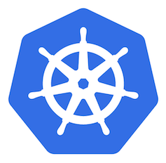

<style>

section {
  background-color: #fefefe;
  color: #333;
}

img[alt~="center"] {
  display: block;
  margin: 0 auto;
}
blockquote {
  background: #ffedcc;
  border-left: 10px solid #d1bf9d;
  margin: 1.5em 10px;
  padding: 0.5em 10px;
}
blockquote:before{
  content: unset;
}
blockquote:after{
  content: unset;
}
</style>

<!-- _class: lead -->

# Module 4 : Gestion du cycle de vie des applications

*Formation Kubernetes - Débutant à Avancé*

---

## Plan du Module 4

**Partie 1**
Health checks, gestion des ressources, types de containers

**Partie 2**
Métriques système, logs, utilisation de Prometheus/Grafana

**Partie 3**
HPA, VPA, outils de scaling avancés

**Partie 4**
Rolling updates, Blue/Green, Canary, Rollback

---

<!-- _class: lead -->

# Partie 1 : apps production-ready
## Préparer vos applications pour la production

---

<!-- _class: lead -->

# startup / liveness / readiness probes

---
## Pourquoi rajouter des sondes ?

**Sans sondes :**
- Le kubelet s'assure que le container est *vivant*, c'est à dire, que le processus principal est *vivant*

Mais *vivant* ne veut pas dire fonctionnel ! Ex :

- processus principal figé mais non fonctionnel
- serveur pas prêt à recevoir du trafic
- processus enfant nécessaire mais mort


---

## Les différentes Probes de Kubernetes

Kubernetes ajoute un certain nombre de sondes (probes) visant à répondre à des questions diverses :

- **Startup Probe** : le container a-t-il fini de démarrer ?
- **Liveness Probe** : est ce que le container fonctionne réellement ?
- **Readiness Probe** : est ce que le container est prêt à recevoir du trafic ?

Ces startup / readiness / liveness probes sont gérées par **container**.

---

## Les différents types d'actions des **Probes**

[Probe (v1 core)](https://kubernetes.io/docs/reference/generated/kubernetes-api/v1.33/#probe-v1-core) est une des API de Kubernetes

Il existe 4 grands types de probes aujourd'hui :

- **HTTP** - la plus courante, effectue un call sur un serveur HTTP
- **TCP** - dans le cas où un call HTTP n'est pas possible
- **gRPC** - pour les serveurs gRPC
- **exec** - exécute une commande arbitraire sur le container quand celui ci ne contient pas de serveur

---

## Startup Probe : gérer les démarrages lents

Inhibe les autres sondes du container, jusqu'à ce que l'application soit démarrée.

**Cas d'usage :** apps avec un temps de démarrage long **et** variable.

Trivia : arrivées un peu après les autres (API `beta` en 1.18 / 2020)

---

## Startup Probe : exemple de manifest

```yaml
apiVersion: v1
kind: Pod
metadata:
  name: app-with-startup
spec:
  containers:
  - name: slow-app
    image: myapp:1.0
    ports:
    - containerPort: 8080
    startupProbe:
      httpGet:
        path: /startup
        port: 8080
      periodSeconds: 10
      failureThreshold: 30  #<===== 30 * 10s = 5 minutes max                              
```

---

## Liveness Probe

Redémarre le conteneur si la sonde échoue

```yaml
  [...]
  containers:
  - name: web-app
    livenessProbe:
      httpGet:
        path: /health
        port: 80
      initialDelaySeconds: 30
      periodSeconds: 10
      timeoutSeconds: 5
      failureThreshold: 3
```

---

## Readiness Probe

Retire le Pod du Service si la sonde échoue (sans le redémarrer)

```yaml
  [...]
  containers:
  - name: web-app
    image: myapp:1.0
    ports:
    - containerPort: 8080
    readinessProbe:
      httpGet:
        path: /ready
        port: 8080
      periodSeconds: 5
      failureThreshold: 3
```

---

## Configuration des sondes : paramètres

```yaml
livenessProbe:
  httpGet:
    path: /health
    port: 8080
  initialDelaySeconds: 30    # Délai avant la première vérification
  periodSeconds: 10          # Fréquence des vérifications
  timeoutSeconds: 5          # Timeout par requête
  successThreshold: 1        # Succès consécutifs pour considérer OK
  failureThreshold: 3        # Échecs consécutifs pour considérer KO
```

---

## Types de probes : exemples TCP et exec

```yaml
# Probe TCP - pour bases de données
livenessProbe:
  tcpSocket:
    port: 5432
  initialDelaySeconds: 30
  periodSeconds: 10

# Probe exec - commande personnalisée
livenessProbe:
  exec:
    command:
    - /bin/sh
    - -c
    - "pg_isready -U postgres"
  initialDelaySeconds: 30
  periodSeconds: 10

# Probe gRPC (Kubernetes 1.24+)
livenessProbe:
  grpc:
    port: 9090
  initialDelaySeconds: 30
```

---

## Exemple Python/Flask

```python
@app.route('/health')
def health():
    # Vérifications basiques (pas de dépendances externes)
    return {'status': 'healthy'}, 200

@app.route('/ready')
def ready():
    # Vérification 
    if database.pool_is_available:
        return {'status': 'ready'}, 200
    else:
        return {'status': 'not ready'}, 503

@app.route('/startup')
def startup():
    # Vérifications de démarrage (migrations, init)                                                    
    if app.is_initialized():
        return {'status': 'started'}, 200
    else:
        return {'status': 'starting'}, 503
```

---

<!-- _class: lead -->

# Gestion des ressources

---

## Requests et Limits

k8s est un orchestrateur de containers, mais il a besoin d'aide !

Dans nos manifests YAML, on va définir les besoins (requests) et les limites (limits) de nos containers.

```yaml
  [...]
  containers:
  - name: container1
    resources:
      requests:        # Ressources demandées (au scheduling)
        memory: "256Mi"
        cpu: "250m"
      limits:          # Limites maximales (imposées au runtime)                        
        memory: "512Mi"
        cpu: "500m"
```

---

## Unités des ressources (1/2)

**CPU (`cpu:`) :**
- `1` ou `1000m` = 1 coeur de CPU 
- `100m` = 1 dixième de coeur de CPU

**Mémoire (`memory:` ou `hugepages-<size>:`) :**
- `128Mi` = 128 * 1024 * 1024 bytes
- `128M` = 128 * 1000 * 1000 bytes

---

## Unités de ressources (2/2)

Plus anecdotique, la taille allouée aux modifications éphémères sur un container `ephemeral-storage:` :

**Stockage éphémère :**
- `2Gi` = 2 * 1024³ bytes
- `1500M` = 1500 * 1000² bytes

---

## Quality of Service (QoS) (1/2)

Kubernetes classe les Pods selon leurs ressources CPU et mémoire.

En cas de pression sur la mémoire sur un Node, la QoS détermine dans quel ordre les Pods seront évincés du Node.

**Pods prioritaires pour QoS Guaranteed :**
- Applications critiques (bases de données, API principales)
- Services système essentiels (DNS, ingress controllers)
- Workloads sensibles aux variations de performance

---

## Quality of Service (QoS) (2/2)

**Guaranteed**
- **Tous** les conteneurs ont des requests et limits. Requests = limits.

**Burstable**
- Au moins un des conteneur a requests ou limits. Requests ≠ limits.

**BestEffort**
- Aucun requests ni limits défini

---

<!-- _class: lead -->

# Différents types de containers

---

## Init Containers

Conteneurs qui s'exécutent **avant** les conteneurs principaux.

Peuvent être utiles dans les cas où il est nécessaire de préparer l'environnement pour l'application : 

- changement des permissions sur un volume
- initialisation d'une base de données
- téléchargement de ressources externes
- ...

---

## Init containers : exemple de manifest

```yaml
apiVersion: v1
kind: Pod
metadata:
  name: app-with-init
spec:
  initContainers:
  - name: config-setup
    image: busybox:1.35
    command: ['sh', '-c', 'cp /config-templates/* /shared-config/']                                         
    volumeMounts:
    - name: shared-config
      mountPath: /shared-config
  containers:
  - name: web-app
    image: myapp:1.0
    volumeMounts:
    - name: shared-config
      mountPath: /app/config
  volumes:
  - name: shared-config
    emptyDir: {}
```

---

## Sidecar Containers

Fonctionnalité "relativement récente" (`alpha` en 1.28, `stable` depuis Kubernetes v1.33) :
- init containers *spécial*, `restartPolicy: Always` qui subsistent après le démarrage du container principal.

Utiles pour certains proxy de DB externes (la connexion doit être disponible au boot de l'application principale).

**Note** : ne pas confondre avec le *pattern* sidecar container (container qui étend les fonctionnalités d'un Pod pour du logging, monitoring...)

---


## Sidecar Containers : exemple de manifests

```yaml
apiVersion: batch/v1
kind: CronJob
metadata:
  name: sidecar-cronjob
spec:
  schedule: "* * * * *"
  jobTemplate:
    spec:
      template:
        spec:
          containers:
          - name: sidecar-user
            image: zwindler/sidecar-user
          initContainers:
          - name: slow-sidecar
            image: zwindler/slow-sidecar                                                                 
            restartPolicy: Always
          restartPolicy: Never
```

[blog.zwindler.fr - Kubernetes 1.29 - sidecar container](https://blog.zwindler.fr/2024/07/19/kubernetes-1-29-sidecar-containers/)

---

## Bonnes pratiques pour la production (1/3)

**Probes :**

- ✅ Toujours implémenter liveness ET readiness probes
- ✅ Endpoints légers et rapides (< 1s)
- ✅ Différencier `/health` (basique) et `/ready` (complet)
- ❌ Ne jamais vérifier les dépendances externes dans liveness (incidents en casquade)

---

## Bonnes pratiques pour la production (2/3)

**Limits et requests :**

- ✅ Toujours définir `requests` cpu et mémoire
  - cible = consommation moyenne / habituelle
- ✅ Toujours définir `limits` pour la **mémoire**
  - prévoir assez de marge pour les "bursts"
- ❌ Jamais de `limits` **cpu** pour les applications sensibles à la latence (cf [Stop Using CPU Limits on Kubernetes](https://home.robusta.dev/blog/stop-using-cpu-limits))
- QoS `Guaranteed` seulement pour les **très** applications critiques

---

## Bonnes pratiques pour la production (3/3)

**Sécurité :**
- ✅ `runAsNonRoot: true` par défaut
- ✅ `readOnlyRootFilesystem: true` si possible
- ✅ Supprimer les capabilities non nécessaires (`drop: [ALL]`)
- ✅ Utiliser des images minimales (distroless, alpine)

---

<!-- _class: lead -->

# Partie 2 : Observabilité
## Surveiller et diagnostiquer vos applications

---

TODO

---

<!-- _class: lead -->

# Partie 3 : Scaling et optimisation
## Adapter automatiquement vos ressources

---

TODO

---

<!-- _class: lead -->

# Partie 4 : Stratégies de mise à jour
## Déployer en toute sécurité

---

TODO

---

<!-- _class: lead -->

## TP Module 4

### Déployer, surveiller et mettre à jour une application

**Objectifs :**
- Configurer health checks et ressources pour la production
- Mettre en place un HPA et tester le scaling
- Implémenter différentes stratégies de mise à jour
- Surveiller et déboguer les déploiements

*Instructions détaillées dans TP/module-4/*

---

<!-- _class: lead -->

## Questions ?

*Prêts pour les réseaux et le stockage ?*



---

## Bibliographie

TODO