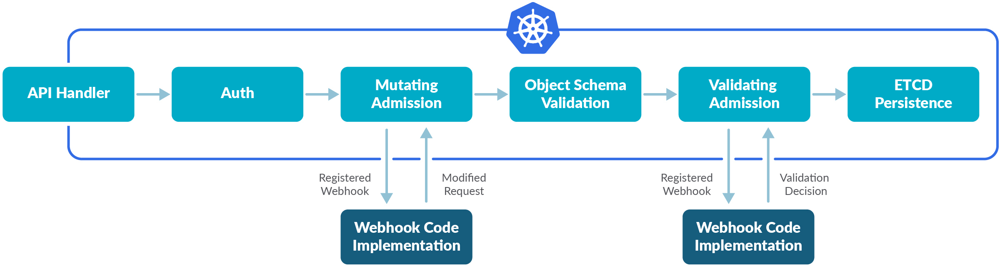
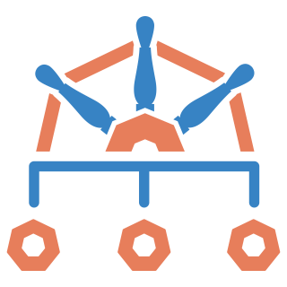

<style>

section {
  background-color: #fefefe;
  color: #333;
}

img[alt~="center"] {
  display: block;
  margin: 0 auto;
}
blockquote {
  background: #ffedcc;
  border-left: 10px solid #d1bf9d;
  margin: 1.5em 10px;
  padding: 0.5em 10px;
}
blockquote:before{
  content: unset;
}
blockquote:after{
  content: unset;
}
</style>

<!-- _class: lead -->

# Module 5 : Sécurité dans Kubernetes

*Formation Kubernetes - Débutant à Avancé*

---

## Plan du Module 5 (1/2)

**Partie 1 : Contrôle d'accès (RBAC)**
- Ressources RBAC
- Tooling d'audit du RBAC

**Partie 2 : Security Context**
- Configuration sécurisée des Pods
- Capabilities, utilisateurs, filesystem, UserNamespace


---

## Plan du Module 5 (2/2)
**Partie 3 : Admission Control**
- CEL (Common Expression Language)
- Politiques Kyverno, détection de menaces

**Partie 4 : Bonnes pratiques**
- Container security, cluster hardening

---

<!-- _class: lead -->

# Partie 1 : Contrôle d'accès (RBAC)

---

## Introduction au RBAC : principes généraux

**Role-Based Access Control** : contrôle d'accès basé sur les rôles

Dans Kubernetes, **tout est API** :
- Créer un Pod → `POST /api/v1/namespaces/default/pods`  
- Lister les Services → `GET /api/v1/services`
- Supprimer un Deployment → `DELETE /apis/apps/v1/deployments/nginx`

**RBAC** définit **qui** peut faire **quoi** sur **quelles ressources**.

---

## Users, Groups, ServiceAccounts

**Users** : Humains (développeurs, ops, admins)
- Gérés **en dehors** de Kubernetes (OIDC, certificats, LDAP...)
- mais pas d'objet `User` dans l'API

**Groups** : Groupes d'utilisateurs (ex. `system:masters`, `developer-team`)

**ServiceAccounts** : Identités pour les applications
- Utilisés par les Pods pour accéder à l'API
- Un par namespace par défaut (`default`)

---

## Roles

**Role** : permissions **dans** un **namespace**
```yaml
apiVersion: rbac.authorization.k8s.io/v1
kind: Role
metadata:
  namespace: production
  name: pod-reader
rules:
- apiGroups: [""]
  resources: ["pods"]
  verbs: ["get", "list"]
```

---

## ClusterRoles

**ClusterRole** : permissions à l'échelle du **cluster**
```yaml
apiVersion: rbac.authorization.k8s.io/v1
kind: ClusterRole
metadata:
  name: cluster-reader
rules:
- apiGroups: [""]
  resources: ["nodes", "namespaces"]  
  verbs: ["get", "list"]
```

---

## RoleBindings

Lie un Role à des sujets dans un namespace

```yaml
apiVersion: rbac.authorization.k8s.io/v1                                              
kind: RoleBinding
metadata:
  name: developers-pods
  namespace: production
subjects:
- kind: ServiceAccount
  name: deployment-sa
  namespace: production
roleRef:
  kind: Role
  name: pod-reader
  apiGroup: rbac.authorization.k8s.io
```

---

## ClusterRoleBinding

Pareil mais pour un ClusterRole

```yaml
apiVersion: rbac.authorization.k8s.io/v1                                                  
kind: ClusterRoleBinding
metadata:
  name: cluster-admins
subjects:
- kind: User
  name: admin
  apiGroup: rbac.authorization.k8s.io
- kind: Group
  name: system:masters
  apiGroup: rbac.authorization.k8s.io
roleRef:
  kind: ClusterRole
  name: cluster-admin
  apiGroup: rbac.authorization.k8s.io
```

---

## Tooling d'audit du RBAC

**Vérifier les permissions :**
```bash
# Vérifier si un utilisateur peut faire une action
kubectl auth can-i create pods --as=alice
kubectl auth can-i get secrets --as=system:serviceaccount:default:my-sa

# Lister toutes les permissions d'un utilisateur
kubectl auth can-i --list --as=alice

# Voir les permissions dans un namespace
kubectl auth can-i --list --as=alice -n production
```

---

## Quelques autres outils d'audit

**Plugins kubectl utiles :**
- `kubectl who-can` : [Plugin](https://github.com/aquasecurity/kubectl-who-can) - Découvrir qui peut faire quoi
- `rbac-lookup` : [Outil](https://github.com/FairwindsOps/rbac-lookup) - Analyser les permissions RBAC
- `kubectl rbac-tool` : [Plugin](https://github.com/alcideio/rbac-tool) - Visualiser et analyser les règles RBAC

**Outils d'audit avancés :**
- **Falco** : Détection des violations RBAC en runtime
- **Polaris** : Audit automatique des configurations de sécurité

---

<!-- _class: lead -->

# Partie 2: Security Context

---

## Security Context : Configuration sécurisée des Pods

Le **Security Context** définit les privilèges et contrôles d'accès pour un Pod ou Container.

Ces Security Contexts peuvent être définis à 2 niveaux :

* pod (pour tous les containers du pod)
* container

---

## Security Context au niveau du Pod

```yaml
apiVersion: v1
kind: Pod
metadata:
  name: security-context-demo
spec:
  securityContext:
    <paramètres de sécurité>
  [...]
  containers:
  - name: sec-ctx-demo
    image: busybox:1.28
    command: [ "sh", "-c", "sleep 1h" ]
```

---

## Security Context au niveau du container

Info : le **Container-level** a la priorité sur **Pod-level** :

```yaml
apiVersion: v1
kind: Pod
metadata:
  name: security-context-demo-2
spec:
  securityContext:
    runAsUser: 1000
  containers:
  - name: sec-ctx-demo-2
    image: busybox:1.28
    command: [ "sh", "-c", "sleep 1h" ]
    securityContext:
      <paramètres de sécurité>      # Priorité sur Pod-level                       
```

---

## Quelques concepts de base

- **runAsUser**: UID du processus principal
- **runAsGroup**: GID principal du processus
- **fsGroup**: GID propriétaire des volumes
- **privileged**: Accès complet au système hôte (dangereux !)
- **allowPrivilegeEscalation**: Permet l'escalade de privilèges
- **readOnlyRootFilesystem**: Système de fichiers racine en lecture seule
- **runAsNonRoot**: Force l'exécution avec un utilisateur non-root

---

### Capabilities
Contrôle fin des privilèges système : les capabilities Linux permettent de donner des permissions spécifiques sans donner tous les droits root.

```yaml
securityContext:
  capabilities:
    add: ["NET_ADMIN", "SYS_TIME"]
    drop: ["ALL"]
```

---

## Security context : exemple avec nginx

```yaml
apiVersion: v1
kind: Pod
metadata:
  name: nginx-insecure
spec:
  containers:
  - name: nginx
    image: nginx:1.30
    ports:
    - containerPort: 80
```

---

## Security context : exemple **sécurisé**

```yaml
apiVersion: v1
kind: Pod
metadata:
  name: nginx-secure
spec:
  securityContext:
    runAsNonRoot: true
    runAsUser: 1001
    fsGroup: 1001
  containers:
  - name: nginx
    image: nginx:1.30
    ports:
    - containerPort: 8080  # Port non-privilégié
    securityContext:
      allowPrivilegeEscalation: false
      readOnlyRootFilesystem: true
      capabilities:
        drop: ["ALL"]         
```

---

## SELinux

Système de contrôle d'accès obligatoire (MAC) au niveau kernel
```yaml
securityContext:
  seLinuxOptions:
    level: "s0:c123,c456"
    type: "container_t"
    user: "system_u"
    role: "system_r"
```

---


## AppArmor profiles

Système de sécurité par profils pour confiner les applications

```yaml
metadata:
  annotations:
    container.apparmor.security.beta.kubernetes.io/container-name: runtime/default
spec:
  containers:
  - name: container-name
    # ...
```

---

## Paramètres `sysctl`

Configuration des paramètres du kernel Linux pour un seul *Pod*. 
⚠️ : tous les paramètres ne sont pas considérés "safe" :

```yaml
spec:
  securityContext:
    sysctls:
    - name: kernel.shm_rmid_forced # safe
      value: "0"
    - name: net.core.somaxconn # unsafe!
      value: "1024"
```

[Plus d'infos dans la doc officielle kubernetes.io/docs/tasks/administer-cluster/sysctl-cluster](https://kubernetes.io/docs/tasks/administer-cluster/sysctl-cluster/) 

---

## Vérification des UID/GID

```bash
# Dans le container non-sécurisé (nginx-insecure)
kubectl exec -it nginx-insecure -- id
# uid=0(root) gid=0(root) groups=0(root)

kubectl exec -it nginx-insecure -- ps aux
# USER       PID %CPU %MEM    VSZ   RSS TTY      STAT START   TIME COMMAND
# root         1  0.0  0.0  11528  7396 ?        Ss   10:30   0:00 nginx: master process

# Dans le container sécurisé (nginx-secure)
kubectl exec -it nginx-secure -- id
# uid=1001 gid=1001 groups=1001

kubectl exec -it nginx-secure -- ps aux
# USER       PID %CPU %MEM    VSZ   RSS TTY      STAT START   TIME COMMAND
# 1001         1  0.0  0.0  11528  7396 ?        Ss   10:30   0:00 nginx: master process      
```

---

## Test des capabilities (1/2)

```bash
# Test de ping (nécessite CAP_NET_RAW)
kubectl exec -it nginx-insecure -- ping -c 1 8.8.8.8
# PING 8.8.8.8 (8.8.8.8): 56 data bytes
# 64 bytes from 8.8.8.8: icmp_seq=0 ttl=113 time=15.123 ms ✅

kubectl exec -it nginx-secure -- ping -c 1 8.8.8.8
# ping: socket: Operation not permitted ❌
```

---

## Test des capabilities (2/2)

```bash
# Test lecture seule du filesystem
kubectl exec -it nginx-insecure -- touch /test-file
# (Réussit) ✅

kubectl exec -it nginx-secure -- touch /test-file
# touch: /test-file: Read-only file system ❌

# Test des capabilities disponibles
kubectl exec -it nginx-insecure -- cat /proc/1/status | grep Cap
kubectl exec -it nginx-secure -- cat /proc/1/status | grep Cap
# (Le Pod sécurisé aura beaucoup moins de capabilities)
```

---

## UserNamespace

Par défaut, UID/GID dans le conteneur = UID/GID sur l'hôte.

Si un attaquant s'échappe d'un container qui tourne en `root`, il devient `root` de l'hôte sous-jacent !

Dans les cas où il n'est pas possible de **ne pas** exécuter un container en `root`, on peut utiliser la fonctionnalité **UserNamespaces** (alpha en 1.25, beta depuis 1.30). Les UID/GID du container sont alors uniques (offset côté hôte, transparent pour le container)


* [kubernetes.io - User Namespaces](https://kubernetes.io/docs/concepts/workloads/pods/user-namespaces/)

---

## UserNamespace : exemple de manifest

```yaml
apiVersion: v1
kind: Pod
metadata:
  name: pod-with-userns
spec:
  hostUsers: false  # Active l'isolation UserNamespace
  securityContext:
    runAsUser: 1000
    runAsGroup: 1000
  containers:
  - name: app
    image: alpine:3.18
    command: ["sleep", "3600"]
```

---

## Vérification de la fonctionnalité

```bash
# Test de l'isolation
kubectl apply -f pod-with-userns.yaml

# Dans le conteneur : UID 1000
kubectl exec -it pod-with-userns -- id
# uid=1000 gid=1000

# Sur le nœud : UID mappé avec l'offset
sudo cat /proc/$(pgrep -f "sleep 3600")/status | grep Uid
# Uid:    231072  231072  231072  231072
```

---

<!-- _class: lead -->

# Partie 3: Admission Control

---

## C'est quoi l'admission control ?

Mécanisme qui intercepte les requêtes à l'API Server après l'authentification et l'autorisation, mais **avant** la persistance des objets.


*source : [Kubernetes admission controllers in 5 minutes](https://www.sysdig.com/blog/kubernetes-admission-controllers)*

---

## Types d'admission controllers

1. **Validating Admission Controllers** : Valident les requêtes
2. **Mutating Admission Controllers** : Modifient les requêtes
3. **Admission Webhooks** : Controllers personnalisés

---

## Admission Controllers natifs

Exemples d'admission controllers intégrés :
- **NodeRestriction** : Limite les permissions des kubelets
- **ResourceQuota** : Applique les quotas de ressources
- **LimitRanger** : Applique les limites par défaut
- **PodSecurityPolicy** : ⚠️ Déprécié en v1.25

<br/>

[kubernetes.io - liste des controllers disponibles](https://kubernetes.io/docs/reference/access-authn-authz/admission-controllers/)

---

## Etendre les possibilités natives

Par défaut, Kubernetes autorise "trop" de choses à l'utilisateur final. On va vouloir restreindre les possibilités.

Il existe plusieurs façon d'étendre l'admission control dans Kubernetes

- développer soi même un webhook
- utiliser un outil comme Kyverno ou OPA/Gatekeeper
- **CEL** (Common Expression Language)!

---

## CEL : Common Expression Language

**"Nouveauté" Kubernetes native** (alpha 1.26) pour définir des politiques d'admission sans webhook externe !

- **Validating Admission Policy** (stable v1.30)
- **Mutating Admission Policy** (beta v1.34)

- Intégré nativement dans Kubernetes
- Pas besoin de webhook externe
- Syntaxe "simple"

---

## CEL : exemple Validating Admission Policy

```yaml
apiVersion: admissionregistration.k8s.io/v1
kind: ValidatingAdmissionPolicy
metadata:
  name: "require-non-root"
spec:
  failurePolicy: Fail
  matchConstraints:
    resourceRules:
    - operations: ["CREATE", "UPDATE"]
      apiGroups: [""]
      apiVersions: ["v1"]
      resources: ["pods"]
  validations:
  - expression: "object.spec.securityContext.runAsNonRoot == true"
    message: "Pod must run as non-root user"
  - expression: "object.spec.containers.all(c, c.securityContext.allowPrivilegeEscalation == false)"
    message: "Containers must not allow privilege escalation"
```

---

## CEL : Binding de la politique

```yaml
apiVersion: admissionregistration.k8s.io/v1
kind: ValidatingAdmissionPolicyBinding
metadata:
  name: "require-non-root-binding"
spec:
  policyName: "require-non-root"
  validationActions: [Warn, Audit]  # ou [Deny] pour bloquer
  matchResources:
    namespaceSelector:
      matchLabels:
        environment: "production"
```

Politique réutilisable avec différents bindings selon les namespaces

---

## Politiques de conformité

Il existe 2 logiciels permettant de faciliter la création et l'application de politiques de conformités dans Kubernetes :

* Open Policy Agent  
* Kyverno 

OPA est un outil générique, Kyverno est *Kubernetes-native*

* [Blog zwindler - Vos politiques de conformité sur k8s avec OPA et Gatekeeper](https://blog.zwindler.fr/2020/07/20/vos-politiques-de-conformite-sur-kubernetes-avec-opa-et-gatekeeper/)
* [Blog zwindler - Vos politiques de conformité sur k8s avec Kyverno](https://blog.zwindler.fr/2022/08/01/vos-politiques-de-conformite-sur-kubernetes-avec-kyverno/)

---

##  C'est quoi Kyverno ?

Moteur de politiques *cloud-native* pour Kubernetes

- Syntaxe YAML native (pas de DSL) + [JMESPath](https://release-1-12-0.kyverno.io/docs/writing-policies/jmespath/)
- Validation, mutation et génération de ressources
- Reporting et observabilité intégrés (policy-reporter + ui)
- 2 types de politiques :
  - **ClusterPolicy** : à l'échelle du cluster
  - **Policy** : dans un namespace spécifique

---

## Kyverno : exemple de politique

```yaml
apiVersion: kyverno.io/v1
kind: ClusterPolicy
metadata:
  name: require-pod-rnu-as-non-root
spec:
  validationFailureAction: enforce
  background: true
  rules:
  - name: check-security-context
    match:
      any:
      - resources:
          kinds:
          - Pod
    validate:
      message: "Security context with runAsNonRoot at pod level is required"
      pattern:
        spec:
          securityContext:
            runAsNonRoot: true                                                                         
```

---

## Kyverno : quelques concepts (1/2)

**Validation** : `enforce` ou `audit`
```yaml
spec:
  validationFailureAction: enforce  # Bloque la création
  # validationFailureAction: audit   # Permet avec un warning + log
```

**Background scanning** : audit des ressources existantes
```yaml
spec:
  background: true  # Scanne aussi l'existant
```

---

## Kyverno : quelques concepts (2/2)

**Mutation** : modification automatique d'un objet avant sa création

```yaml
rules:
- name: add-security-context
  match:
    any:
    - resources:
        kinds: [Pod]
  mutate:
    patchStrategicMerge:
      spec:
        securityContext:
          runAsNonRoot: true
```

---

## Kyverno : tests de politiques

Kyverno permet aussi de tester (TU) ses policies `kyverno test .` :

```yaml
apiVersion: cli.kyverno.io/v1alpha1
kind: Test
metadata:
  name: test-security-policy
policies:
- policy.yaml
resources:
- pod-good.yaml
- pod-bad.yaml  
results:
- policy: require-pod-security-standards
  rule: check-security-context
  resource: pod-good
  result: pass
- policy: require-pod-security-standards                                                                     
  rule: check-security-context
  resource: pod-bad
  result: fail
```

---

## Détection de menaces : concepts (1/2)

Pour sécuriser le cluster, 2 concepts sont complémentaires : 

- **runtime analysis** (moteur de détection en temps réel) 
- **static analysis** (analyse statique, notamment des images)

---

## Détection de menaces : concepts (2/2)


**Objectifs de la static analysis** :
- Scanner les vulnérabilités des images **avant** déploiement
- Vérifier la conformité aux politiques de sécurité
- Détecter les *secrets* hardcodés dans le code

**Objectifs de la runtime analysis** :
- Détecter les comportements suspects, escalades de privilèges ou accès non autorisés aux ressources en temps réel
- Alerter sur les violations de politiques de sécurité

---

## runtime analysis : exemple avec Falco (1/2)


Processus (ou container) privilégié sur les **Nodes**

- Surveille les appels système (syscalls)
- Règles de détection configurables
- Intégration avec SIEM/alerting


---

## runtime analysis : exemple avec Falco (2/2)

```yaml
- rule: Unexpected root access
  desc: Detect unexpected root access to container
  condition: >
    spawned_process and container and
    proc.euser.name = root and
    not user_known_exec_in_container
  output: >
    Unexpected root access (user=%user.name command=%proc.cmdline 
    image=%container.image.repository:%container.image.tag)
  priority: WARNING
```

---

## static analysis (1/2)

**Outils de scan de vulnérabilités d'images** :
- [Trivy](https://trivy.dev/) : Scanner de vulnérabilités open-source
- [Grype](https://github.com/anchore/grype) : Analyse de sécurité des conteneurs

```bash
# Exemple avec Trivy
trivy image nginx:1.30
# Scanne les vulnérabilités CVE dans l'image

# Exemple avec un pipeline CI/CD
trivy image --severity HIGH,CRITICAL --exit-code 1 myapp:latest                
# Bloque le déploiement si vulnérabilités critiques
```

---

## static analysis (2/2)

**Outils d'analyse de configuration** :
- **Polaris** : [Audit des best practices Kubernetes](https://polaris.docs.fairwinds.com/)
- **Datree** : [Validation des manifests YAML](https://datree.io/)
- **Kubesec** : [Scanner de sécurité pour les ressources K8s](https://kubesec.io/)

---

<!-- _class: lead -->

# Partie 4: Bonnes pratiques

---

## Bonnes pratiques de création des images

- Utiliser des images officielles ou trusted registries
- **Diminuer la surface d'attaque** (distroless, scratch, multi-stage)
- Pas de root dans les Dockerfiles
- Secrets management (pas de hardcoding)
- Scan de vulnérabilités (Trivy, Snyk, etc.)
- Signatures d'images (cosign, notation)
- SBOM (Software Bill of Materials)

---

## Bonnes pratiques de création des clusters

**Réseau :**
- Network Policies (segmentation)
- Ingress avec TLS
- mTLS ! (nécessite parfois un Service Mesh)

**Nodes :**
- hardening OS (CIS) **ou** OS minimaliste immutables ([Talos Linux](https://www.talos.dev/))
- modules de sécurité Kernel (AppArmor, SELinux)
- Mise à jour régulières

**Control plane :**
- etcd encryption at rest
- API server audit logging
- Admission controllers activés

---

## Bonnes pratiques pour la production

**Security Context (rappel) :**
- `runAsNonRoot: true` par défaut
- `readOnlyRootFilesystem: true` si possible
- Supprimer les capabilities non nécessaires (`drop: [ALL]`)

**RBAC :**
- Principe de moindre privilège
- ServiceAccounts dédiés par application
- Audit régulier des permissions

---

## Resources et outils (1/3)

**Documentation officielle :**
- [Pod Security Standards](https://kubernetes.io/docs/concepts/security/pod-security-standards/)
- [RBAC Guide](https://kubernetes.io/docs/reference/access-authn-authz/rbac/)

---

## Resources et outils (2/3)

**Outils de sécurité :**
- [Kyverno](https://kyverno.io/) : Politiques de sécurité
- [Falco](https://falco.org/) : Détection de menaces
- [Trivy](https://trivy.dev/) : Scan de vulnérabilités
- [kubebench](https://github.com/aquasecurity/kube-bench) : CIS benchmark pour K8s

---

## Resources et outils (3/3)

**Frameworks de sécurité :**
- [NIST Cybersecurity Framework](https://www.nist.gov/cyberframework)
- [CIS Kubernetes Benchmark](https://www.cisecurity.org/benchmark/kubernetes)
- [NSA/CISA Kubernetes Security Guidance](https://media.defense.gov/2022/Aug/29/2003066362/-1/-1/0/CTR_KUBERNETES_HARDENING_GUIDANCE_1.2_20220829.PDF)