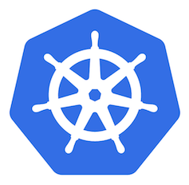
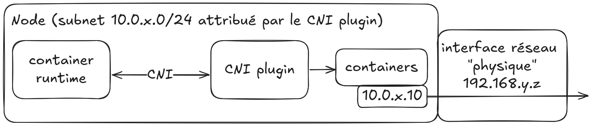

<style>

section {
  background-color: #fefefe;
  color: #333;
}

img[alt~="center"] {
  display: block;
  margin: 0 auto;
}
blockquote {
  background: #ffedcc;
  border-left: 10px solid #d1bf9d;
  margin: 1.5em 10px;
  padding: 0.5em 10px;
}
blockquote:before{
  content: unset;
}
blockquote:after{
  content: unset;
}

table {
  font-size: 30px;
}

ul {
  margin-top: 17px;
  margin-bottom: 17px;
}
</style>

<!-- _class: lead -->

# Module 6 : CRI, CNI, CSI, extensibilité de Kubernetes

*Formation Kubernetes - Débutant à Avancé*

---

## Plan du Module 6 (1/2)

**Partie 1 : Vue d'ensemble de l'écosystème**
- CRI, CNI, CSI : 3 interfaces importantes dans k8s

**Partie 2 : CNI et Cilium**
- Focus sur Cilium et eBPF et alternatives
- Network Policies avancées et observabilité



---

## Plan du Module 6 (2/2)

**Partie 3 : CSI et Rook Ceph**
- Focus sur Rook Ceph et alternatives
- Types de stockage : block, file, object

**Partie 4 : Extensibilité avec les CRD**
- Custom Resource Definitions et pattern Operator
- Exemples concrets dans l'écosystème


---

<!-- _class: lead -->

# Partie 1 : Vue d'ensemble de l'écosystème

---

## Kubernetes : une plateforme extensible

Kubernetes a été conçu pour être **modulaire** et **extensible**. Il existe donc des interfaces pour unifier la façon dont on :

- Exécute les conteneurs --> **CRI** (Container Runtime Interface) 
- Connecte les conteneurs --> **CNI** (Container Network Interface)
- Stocke les données --> **CSI** (Container Storage Interface)

> Cette approche permet de rendre facilement compatibles à Kubernetes les outils du marché

---

## Pourquoi cette modularité ?

**Avantages** :
- **Choix** : Sélectionner les composants adaptés à son contexte
- **Innovation** : Écosystème riche avec de nombreuses solutions
- **Migration** : Changer de composant sans refaire tout le cluster
- **Spécialisation** : Optimisation pour des cas d'usage particuliers

**Inconvénients** :
- **Complexité** : Décisions structurantes à prendre dès l'instanciation du cluster

---

<!-- _class: lead -->

# CRI : Container Runtime Interface

---

## CRI : L'interface pour les runtimes

Le **Container Runtime Interface** définit comment kubelet communique avec le runtime de conteneurs.

**Évolution historique** :
- **Docker** : Premier runtime supporté (intégration directe)
- **CRI** : Interface standardisée (Kubernetes 1.5, 2017)
- **Dockershim deprecated** : Kubernetes 1.24 (2022)

> Aujourd'hui, kubelet utilise **uniquement** l'interface CRI !

---

## Quelques runtimes CRI

| Runtime | Description | Cas d'usage |
|---------|-------------|-------------|
| **containerd** | Runtime CNCF, successeur de Docker, devenu standard de facto | Production standard |
| **CRI-O** | Runtime Red Hat | Production standard |
| **Kata Containers** | Runtime sécurisé avec micro-VMs | Workloads nécessitant une meilleure isolation |

> Trivia : peu le savent, mais on peut toujours utiliser Docker pour exécuter ses containers dans Kubernetes ! 
> * https://github.com/Mirantis/cri-dockerd

---

## Focus : Kata Containers (1/2)

**Kata Containers** offre une **isolation renforcée** :

- Chaque Pod s'exécute dans une **micro-VM légère**
- **Sécurité** : Isolation kernel complète
- **Performance** : Démarrage rapide (~100ms)
- **Compatibilité** : API OCI standard

> **OCI** = Open Container Initiative (standard pour les runtimes de conteneurs)

---

## Focus : Kata Containers (2/2)

**Cas d'usage** :
- Workloads multi-tenant
- Applications non-trustées
- Compliance stricte
- Applications à licences, nécessitant de réduire le nombre de cores

---

<!-- _class: lead -->

# Partie 2 : CNI et focus Cilium

---

## CNI : Container Network Interface

Le **Container Network Interface** définit comment configurer le réseau des conteneurs :
- Attribution d'adresses IP aux Pods
- Configuration du routage inter-Pods
- Gestion des politiques réseau
- Connectivité externe



---

## Focus **NetworkPolicies**

**Dans k8s, tous les Pods peuvent communiquer entre eux** !!!

Les **NetworkPolicies** permettent la **microsegmentation réseau** dans Kubernetes :
- Contrôle du trafic entrant (Ingress) et sortant (Egress)
- Filtrage basé sur les labels des Pods
- Règles par namespace, port, protocole

> C'est un peu le "firewall" des Pods

⚠️ **Prérequis** : CNI qui supporte Network Policies

---

## Network Policies : principes

- Sans Network Policy → **tout est autorisé**
- Dès la 1ère Network Policy → **deny by default** + règles explicites

**Types de politiques** :
- **Ingress** : Contrôle du trafic entrant vers les Pods
- **Egress** : Contrôle du trafic sortant depuis les Pods

**Sélection des Pods** :
- Via `podSelector` (labels)
- Via `namespaceSelector`

---

## Network Policies - deny all

```yaml
apiVersion: networking.k8s.io/v1
kind: NetworkPolicy
metadata:
  name: deny-all
  namespace: production
spec:
  podSelector: {}  # Sélectionne tous les Pods
  policyTypes:
  - Ingress
  - Egress
  # Pas de règles allow = DENY ALL
```

---

## Network Policies - allow spécifique

**Exemple : autoriser seulement frontend → backend** :

```yaml
apiVersion: networking.k8s.io/v1
kind: NetworkPolicy
metadata:
  name: allow-frontend-to-backend
  namespace: production
spec:
  podSelector:
    matchLabels:
      app: backend
  policyTypes: [Ingress]
  ingress:
  - from:
    - podSelector:
        matchLabels:
          app: frontend
    ports:
    - protocol: TCP
      port: 8080                                                                                           
```

---

## Panorama des solutions CNI

| CNI | Description | Points forts |
|-----|-------------|--------------|
|  | CNI simple (basique) | Simplicité, déploiement facile |
|  **Calico** | CNI avancé | Performance, BGP, NetworkPolicies |
|  | CNI eBPF | eBPF, BGP,  observabilité, sécurité |

<br>

**Cilium** est probablement le CNI le plus "en vogue" grâce à ses fonctionnalités avancées et ses performances

---

##  cilium : CNI nouvelle génération


Corrige toutes les limitations réseau de Kubernetes à l'aide d'**eBPF** :

- **Performance** : Traitement réseau dans le kernel
- **Observabilité** : Visibilité complète du trafic
- **Sécurité** : Policies layer 3-7
- **Service Mesh** : Capacités natives

> eBPF = "extended Berkeley Packet Filter"


---

## focus 

**eBPF** permet d'exécuter du code côté kernel de manière sécurisée :

- **Pas de modules kernel** : Code vérifié et sandboxé
- **Performance native** : Traitement au niveau kernel
- **Flexibilité** : Programmation des fonctions réseau

**Applications dans Cilium** :
- Routage et load balancing
- Filtrage et policies
- Monitoring et tracing

---

## Cilium : Kube-proxy replacement

Cilium peut **remplacer kube-proxy** :

**Avantages** :
- **Performance** : eBPF vs `iptables`
- **Fonctionnalités** : Load balancing avancé
- **DSR** : Direct Server Return pour TCP

```bash
# Activer le mode kube-proxy replacement
cilium install --set kubeProxyReplacement=strict
```

---

## Network Policies avancées avec Cilium

**Cilium Network Policies** (Layer 7) :

```yaml
apiVersion: cilium.io/v2
kind: CiliumNetworkPolicy                                                                                             
metadata:
  name: http-policy
spec:
  endpointSelector:
    matchLabels:
      app: backend
  ingress:
  - fromEndpoints:
    - matchLabels:
        app: frontend
    toPorts:
    - ports:
      - port: "8080"
        protocol: TCP
      rules:
        http:
        - method: "GET"
          path: "/api/.*"
```

---

## Hubble : observabilité réseau

**Hubble** est l'outil d'observabilité de Cilium :

- **Visibilité** : flux réseau en temps réel
- **Debugging** : problèmes de connectivité
- **Compliance** : audit des communications

```bash
# Installer Hubble UI
cilium hubble enable --ui

# Observer les flux
hubble observe --follow
```


---

<!-- _class: lead -->

# Partie 3 : CSI et focus Rook Ceph

---

## Problématiques du stockage dans K8s

- **Persistance** : Les Pods sont éphémères
- **Haute disponibilité** : Réplication et récupération
- **Performance** : Latence et débit
- **Types variés** : Block, file, object storage

---

## CSI : Container Storage Interface (1/2)

Le **Container Storage Interface** standardise l'intégration du stockage dans Kubernetes.

- **Avant CSI** : Chaque solution de stockage était intégrée directement dans le code Kubernetes (in-tree).
- **Depuis** : Interface standard permettant aux fournisseurs de stockage de développer leurs propres plugins (out-of-tree).

---

## CSI : Container Storage Interface (2/2)

**Le CSI gère le cycle de vie complet des volumes** :

- **Provisioning** : Création automatique de volumes à la demande
- **Attach/Detach** : Connexion des volumes aux nœuds
- **Mount/Unmount** : Montage dans les Pods
- **Fonctionnalités autres** : Snapshots, agrandissement des volumes...

---

## Panorama des solutions CSI

**Solutions cloud** : AWS EBS, GCE Persistent Disk, Azure Disk, etc.

**Solutions auto-gérées** :

| Solution | Points forts | Cas d'usage |
|----------|--------------|-------------|
| **Rook Ceph** | Stockage distribué, multi-type | Production, haute disponibilité |
| **Longhorn** | Simple, interface web | Simplicité, PME |
| **OpenEBS** | Cloud-native, performant | Performance, microservices |

**Rook Ceph** est une solution complète et mature pour le stockage auto-géré.

---

## Rook Ceph : stockage distribué

**Rook** ([rook.io](https://rook.io/)) est l'opérateur Kubernetes qui déploie **Ceph**

**Architecture** :
- **Monitors** (MON) : Gestion du cluster
- **Managers** (MGR) : Monitoring et administration  
- **OSDs** : Object Storage Daemons (stockage effectif)


---

## Types de stockage avec Rook Ceph (1/3)

**Block Storage** (RBD - RADOS Block Device)
```yaml
apiVersion: storage.k8s.io/v1
kind: StorageClass
metadata:
  name: rook-ceph-block
provisioner: rook-ceph.rbd.csi.ceph.com
parameters:
  clusterID: rook-ceph
  pool: replicapool
  fstype: ext4
```

- **Mode d'accès** : ReadWriteOnce (RWO) - un seul Pod à la fois
- **Usage** : Bases de données, applications avec besoin de perf

---

## Types de stockage avec Rook Ceph (2/3)

**File Storage** (CephFS - Ceph File System)
```yaml
apiVersion: storage.k8s.io/v1
kind: StorageClass
metadata:
  name: rook-cephfs
provisioner: rook-ceph.cephfs.csi.ceph.com
parameters:
  clusterID: rook-ceph
  fsName: myfs
```

- **Mode d'accès** : ReadWriteMany (RWX) - plusieurs Pods
- **Usage** : Partage de fichiers, logs centralisés, assets statiques

---

## Types de stockage avec Rook Ceph (3/3)

**Object Storage** (RADOS Gateway - RGW)

- **Interface** : API S3 et Swift compatibles
- **Usage** : 
  - Stockage de fichiers statiques (images, vidéos)
  - Backups et archives
  - Applications web modernes
- **Avantages** : Scalabilité infinie, accès HTTP/HTTPS

```bash
# Exemple d'accès S3
aws s3 ls --endpoint-url http://rook-ceph-rgw.rook-ceph.svc.cluster.local       
```

---

## Avantages de Rook Ceph

**Résilience** :
- Réplication configurable (2x, 3x, etc.), auto-healing
- Expansion dynamique du cluster

**Flexibilité** :
- Support des 3 types de stockage

**Cloud-native** :
- Déploiement via Helm/Operator
- Gestion via CRDs Kubernetes

---

<!-- _class: lead -->

# Partie 4 : Extensibilité avec les CRD
## Étendre les capacités de Kubernetes

---

## Custom Resource Definitions (CRD)

Permettent de créer de **nouveaux types de ressources** dans k8s :

- **Extension de l'API** : Nouveaux objets avec `kubectl get myCustRes`
- **Validation** : Schémas OpenAPI pour valider les données
- **Versioning** : Support de plusieurs versions d'API
- **Storage** : Persistance automatique dans etcd

---

## CRD - exemple de manifest


```yaml
apiVersion: apiextensions.k8s.io/v1
kind: CustomResourceDefinition
metadata:
  name: databases.example.com
spec:
  group: example.com
  versions: [...]
  scope: Namespaced
```

---

## Pattern Operator : CRD + Controller

Un **Operator** = **CRD** + **Controller** + **logique métier**

**Principe hyper important dans Kubernetes !!!**
1. **CRD** : Définit le format des ressources custom
2. **Controller** : Surveille les changements et applique la logique
3. **Reconciliation loop** : Maintient l'état désiré

---

## Exemples d'Operators dans l'écosystème

**Rook Operator** (déjà vu) :
```yaml
apiVersion: ceph.rook.io/v1
kind: CephCluster
metadata:
  name: rook-ceph
spec:
  dataDirHostPath: /var/lib/rook
  monitoring:
    enabled: true
```

Prometheus Operator, Grafana Operator, ...

---

## Avantages du pattern Operator

**Pour les utilisateurs** :
- **Simplicité** : `kubectl apply` pour des systèmes complexes
- **API native** : Intégration transparente avec Kubernetes
- **Déclaratif** : Configuration via YAML, comme tout objet K8s

**Pour les opérateurs** :
- **Automatisation** : Gestion automatique du cycle de vie
- **Résilience** : Auto-healing et reconciliation continue
- **Évolutivité** : Montée de version et migration automatiques

---

## Créer son propre Operator

**Outils de développement** :
- **[Operator SDK](https://sdk.operatorframework.io/)** : Framework officiel (Go, Ansible, Helm)
- **[Kubebuilder](https://kubebuilder.io/)** : Alternative populaire (Go)
- **[Kopf](https://kopf.readthedocs.io/)** : Framework Python
- **[Java Operator SDK](https://javaoperatorsdk.io/)** : Framework Java

---

<!-- _class: lead -->

# TP 6 : Déployer un cluster avec Cilium et stockage persistant

---

## Objectif du TP : écosystème Kubernetes complet

- Déployer un cluster kind avec Cilium comme CNI
- Configurer le stockage persistant avec extraMounts
- Déployer WordPress + MariaDB avec persistence
- Tester les Network Policies et observer avec Hubble

*Instructions détaillées dans TP/module-6/*

---

<!-- _class: lead -->

## Questions ?

*Prêts pour explorer les façons de distribuer des applications pour Kubernetes ?*


---

## Bibliographie (1/3)

**Documentation officielle :**
- [Container Runtime Interface (CRI)](https://kubernetes.io/docs/concepts/architecture/cri/)
- [Container Network Interface (CNI)](https://kubernetes.io/docs/concepts/extend-kubernetes/compute-storage-net/network-plugins/)
- [Container Storage Interface (CSI)](https://kubernetes.io/docs/concepts/storage/volumes/#csi)

---

## Bibliographie (2/3)

**Cilium et eBPF :**
- [Cilium Documentation](https://docs.cilium.io/)
- [eBPF - What is eBPF](https://ebpf.io/what-is-ebpf/)
- [Cilium & Hubble - Network Observability](https://docs.cilium.io/en/stable/overview/intro/#what-is-hubble)

---

## Bibliographie (3/3)

**Stockage et Rook Ceph :**
- [Rook Documentation](https://rook.io/docs/rook/latest/)
- [Ceph Documentation](https://docs.ceph.com/)
- [Kubernetes Storage Classes](https://kubernetes.io/docs/concepts/storage/storage-classes/)
